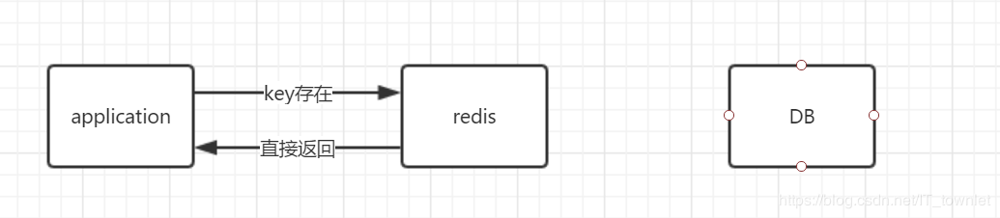
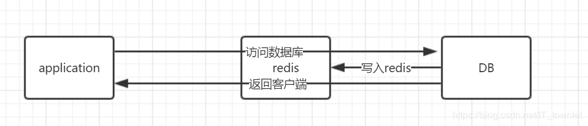
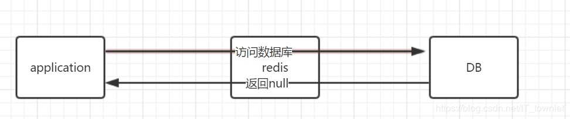

# Redis

1.  > Redis 缓存穿透、缓存击穿、缓存雪崩

    ```JAVA
    1.  缓存穿透: Key 对应的Value在数据源(redis 和 DB)中不存在，每次针对此Key的请求从缓存获取不到，请求都会到DB中去查询，从而可能打垮数据库。

        比如用一个不存在的用户id获取用户信息，不论缓存还是数据库都没有，若黑客利用此漏洞进行攻击可能压垮数据库
    ```
    ```JAVA
    2. 缓存击穿: Key 对应的Value在DB中存在，但在Redis中过期，此时若有大量并发请求过来，请求发现Cache已经过期会从后端DB中进行加载数据并且重新设置到Cache中，此时要是大量并发请求会直接压垮数据库

    ※ 缓存击穿针对的是单条记录在缓存中过期的情况下，大量请求访问同一条数据造成
    ```
    ```JAVA
    3. 缓存雪崩: 当Redis缓存服务器重启或者大量缓存集中在某一个时间段内失效时，请求会直接到达压垮后端系统(DB)

    ※ 缓存雪崩针对的是大量不同数据请求在缓存中大量失效的情况下，造成
    ```

2.  > Redis 缓存穿透及其解决方案(布隆过滤器)

    > 应用程序中缓存访问流程: 
    ```JAVA
    ① : Application访问Redis, 假如数据存在，则直接返回结果.
    ```
    

    ```JAVA
    ② : 数据在Redis中不存在，则直接访问DB，在DB中查询到目标值，写入Redis并返回Applicaion.
    ```
    
    
    ```JAVA
    ③ : 数据在Redis中不存在，DB中也不存在，返回空(null);Redis中是不会写Null值, 若反复发送同一条请数据请求，则会发生缓存穿透;
    ```
    

    > 解决方案: 布隆过滤器(Bloom Filter)

    ```JAVA
    布隆过滤器原理 : 
    
        介绍： 布隆过滤器(BF)是一种空间型高效率的概率型数据结构。它专门用来检测集合中是否包含特定的元素
        
    ```

# https://blog.csdn.net/it_townlet/article/details/88217607
