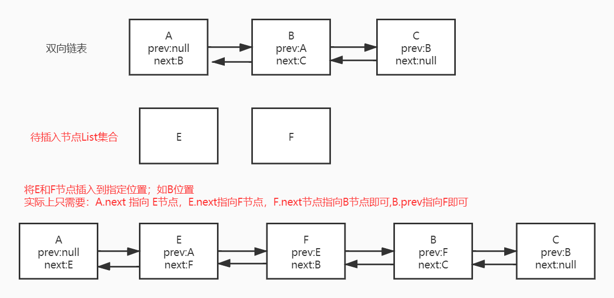

# LinkedList 双向链表

> [!NOTE|label:源码学习]
```java
    public static void main(String[] args) {
        List<String> linkedList = new LinkedList<>();
        linkedList.add("a");
        linkedList.add("b");
    }
```
>[!NOTE|label:源码分析_构造函数]
```java

    /**
     * 构造空LinkedList
     */
    public LinkedList() {
    }

    /**
     * Constructs a list containing the elements of the specified
     * collection, in the order they are returned by the collection's
     * iterator.
     *
     * @param  c the collection whose elements are to be placed into this list
     * @throws NullPointerException if the specified collection is null
     */
    public LinkedList(Collection<? extends E> c) {
        this();
        // 初始化指定Collections
        addAll(c);
    }

```

> [!NOTE|label:add方法实现]
```java
    /**
     * 追加指定元素到list的尾部
     *
     * @param e element to be appended to this list
     * @return {@code true} (as specified by {@link Collection#add})
     */
    public boolean add(E e) {
        // 在list的尾部追加元素
        linkLast(e);
        return true;
    }


    /**
     * Links e as last element.
     */
    void linkLast(E e) {
        // 链表Node中尾节点
        final Node<E> l = last;
        // 创建新的Node节点
        final Node<E> newNode = new Node<>(l, e, null);
        // 将新创建的Node节点当做尾节点
        last = newNode;
        if (l == null)
            // 将新创建的Node节点做首节点
            first = newNode;
        else
            l.next = newNode;
        size++;
        modCount++;
    }

    // 链表Node<E> 实体类
    private static class Node<E> {
        E item;  // 当前值
        Node<E> next; // 下一个节点
        Node<E> prev; // 上一个节点

        Node(Node<E> prev, E element, Node<E> next) {
            this.item = element;
            this.next = next;
            this.prev = prev;
        }
    }
```

> [!NOTE|label:addAll方法实现]

#### 将数据插入到链表的指定位置

```java

    transient int size = 0;

    public boolean addAll(Collection<? extends E> c) {
        return addAll(size, c);
    }
     /**
     * Inserts all of the elements in the specified collection into this
     * list, starting at the specified position.  Shifts the element
     * currently at that position (if any) and any subsequent elements to
     * the right (increases their indices).  The new elements will appear
     * in the list in the order that they are returned by the
     * specified collection's iterator.
     *
     * @param index index at which to insert the first element
     *              from the specified collection
     * @param c collection containing elements to be added to this list
     * @return {@code true} if this list changed as a result of the call
     * @throws IndexOutOfBoundsException {@inheritDoc}
     * @throws NullPointerException if the specified collection is null
     */
    public boolean addAll(int index, Collection<? extends E> c) {
        // 检查是否存在索引下标越界
        checkPositionIndex(index);

        // 将Collection集合内容转换Object数组
        Object[] a = c.toArray();
        int numNew = a.length;
        if (numNew == 0)
            return false;

        Node<E> pred, succ;
        if (index == size) {
            // 从LinkedList的头部开始插入元素
            succ = null;
            pred = last;
        } else {
            // 从指定位置开始插入
            succ = node(index); // 返回指定索引位置的Node节点
            pred = succ.prev;  // 前一个Node节点
        }

        // 参考上图
        for (Object o : a) {
            @SuppressWarnings("unchecked") E e = (E) o;
            Node<E> newNode = new Node<>(pred, e, null);
            if (pred == null)
                first = newNode;
            else
                pred.next = newNode;
            pred = newNode;
        }

        if (succ == null) {
            last = pred;
        } else {
            pred.next = succ;
            succ.prev = pred;
        }

        size += numNew;
        modCount++;
        return true;
    }
```
> [!Warning|label:常见问题|icon:null]
> + LinkedList的优/缺点: 
>   - 插入、删除元素快；
>       - 与ArrayList相比插入/删除元素时，只需要记住该元素的前一个Node节点和后一个Node即可;
而ArrayList在指定位置插入/杀出元素时，需要移动指定位置之后的每一位元素
>   - 查询慢：
>       - **在内存中是一段不连续的空间，需要遍历链表，时间复杂度为O(n)**
>   - 内存占用相比较ArrayList比较多，需要记住前一个Node节点和后一个Node节点
> + LinkedList中是否可以存储NULL？
>   - 可以
>   - LinkedList创建时需要指定泛型，泛型必须是引用类型，NULL可以强制转换为任何引用类型，即自动装箱
>   - LinkedList底层采用双向链表实现，存储Node类型元素，Node类带有泛型E，E继承与Object对象
> + 遍历LinkedList时，为什么优先使用Iterator而不是for？
>   - 因为在获取Iterator迭代器对象时，会进行一次查询返回链表的首节点，即调用一次node(index).之后会根据双向链表的特点进行遍历获取指定元素
>   - for 会每次调用node(index)方法，node(index)方法非常耗时
    ```java
    Demo:
    LinkedList<String> list = new LinkedList<>();
    Iterator iterator = list.iterator();
    while (iterator.hasNext()) {
        String temp = (String)iterator.next();
        System.out.println(temp);
    }
    实现原理：
    list.iterator() 实际上返回的 new listIterator(0)
    public ListIterator<E> listIterator(int index) {
        checkPositionIndex(index);
        return new ListItr(index);
    }
    java.util.LinkedList.ListItr#ListItr
    // ListItr类构造函数
    ListItr(int index) {
        // 获取链表中首节点的元素
        next = (index == size) ? null : node(index);
        nextIndex = index;
    }
    java.util.LinkedList#node
    // 返回指定索引位置的Node节点
    Node<E> node(int index) {
        // assert isElementIndex(index);
        if (index < (size >> 1)) {
            Node<E> x = first;
            for (int i = 0; i < index; i++)
                x = x.next;
            return x;
        } else {
            Node<E> x = last;
            for (int i = size - 1; i > index; i--)
                x = x.prev;
            return x;
        }
    }
    ```
