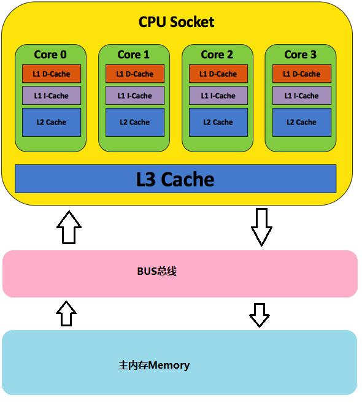
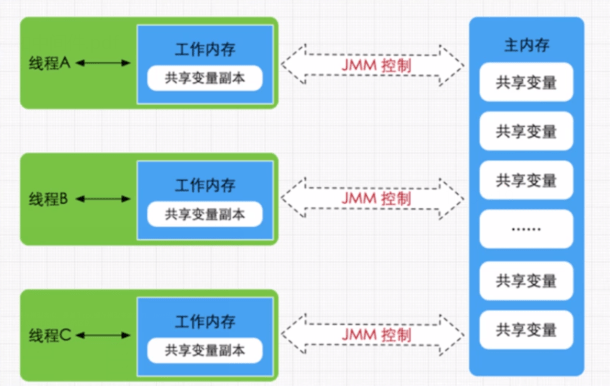
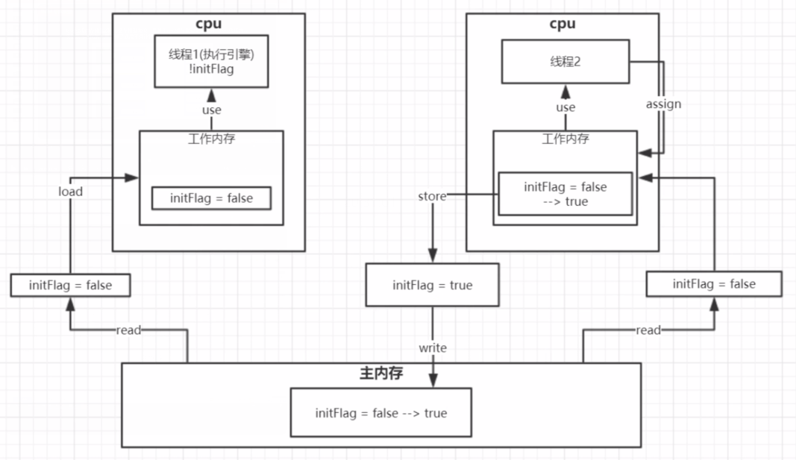
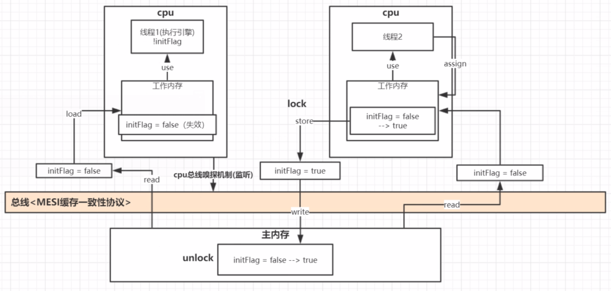

# JAVA 内存模型JMM

> [!Note|label:相关概念]
> - **原子性**: 即一个操作或者多个操作 要么全部执行并且执行过程不会被任何因素打断，要么全部不执行，原子操作是同一时刻只能有一个线程执行，不存在线程切换
> - **原子操作**: 指一个或者多个不可再分割的操作，这些操作的执行顺序是不能被打乱的，也不可以被分割而只执行其中某一部分的内容；具体是指
    不会被线程调度机制打断的操作，这种操作一旦被开始，就一直运行到结束，中间不会有任何上下文切换;“原子操作(atomic operation)是不需要synchronized”
> - CAS(Compare And Swap)具有原子性，是原子操作
> - **volatile**: 不具有**原子性**，具有可见性和有序性

> [!Warning|label:CAS轻量级锁中存在的问题:|icon:null]
>
> + 经典的**ABA**问题
> + 自旋问题

> [!Note|label:JMM内存模型:主内存和工作内存|icon:null]
> + Java线程内存模型跟CPU缓存模型类似，是基于CPU缓存模型建立的；    
>   CPU执行流程图：    
>       
>   JMM 内存模型图：   
>      
>   如JMM内存模型图所示，有多个线程同时运行在不同的CPU上，同时读取一个static变量或者实例变量，为了提高运行速度，会把主内存中的共享变量加载到工作内存中去。所以
>   如果在一个线程中改变了静态变量，另一个线程是觉察不到这个变化的。**Volatile**的关键字的出现，解决了多线程之间变量的可见性问题。Volatile关键字的底层实现是通过MESI缓存一致性协议
>   实现    
> + Java内存底层交互模(JMM8大原子操作)：
>   - read： 从主内存中读取数据
>   - load:  将主内存中读取的数据拷贝至工作内存中
>   - use:   从工作内存中读取数据进行计算
>   - assign: 修改工作内存中的数据
>   - store: 将工作内存中的值写入到主内存中
>   - write: 将变量值复制给主内存中的变量
>   - lock: 将主内存中变量加锁，标识为线程独占状态(MESI中的E状态)
>   - unlock: 将主内存变量解锁，解锁后其他线程可以锁定该变量     
>   多线程之间访问共享变量的工作流程：   
>   
> + 早期Volatile底层是通过给**BUS总线进行加锁**来实现，给**BUS总线加锁**缺点性能太低
>   实现原理: 第一个到达主内存的线程read操作之前，会对主内存加一把锁Lock，直到数据同步回到至内存之后，才会把锁释放掉Unlock。在这个期间，其他线程是无法读取read主内存中的共享变量的值，
>   当锁被释放掉之后，主内存的共享变量的值已经是被同步过的最新的值，其他线程再读取，就是最新数据
> + MESI缓存一致性协议
>   多个CPU同时从主内存中读取同一个数据到各自的高速缓存区，当其中某个CPU修改了缓存中数据，该数据会立马同步回到主内存中，其他CPU通过**总线嗅探机制**可以感知到数据的变化，从而将自己缓存中
>   的数据变为失效状态。当CPU读取自己的工作内存中的数据时，发现数据已经失效，会从主内存中执行read操作，从而解决了可见性问题
>   
> + MESI为缓存行的4中状态的首字母缩写
>   - M(Modified) 修改: 该Cache line有效，数据被修改了,但和内存中数据不一致,数据只存在于Cache中
>   - E(Exclusive) 独占: 该Cache line有效，数据被修改了，与内存中数据一致，数据中存在Cache中
>   - S(Shared) 共享: 该Cache line有效，数据和内存中一致，存在于很多Cache中
>   - I(Invalid) 无效： 该Cache line 已经失效

> [!Warning|label:volatile底层实现|icon:null]
> + 可见性: 多个线程访问同一个变量时，一个线程修改了这个变量的值，其他线程能够立即看到修改的值。
> + 有序性：程序按照写代码的先后顺序进行执行；**CPU处理器为了提高运行效率，可能会对输入代码进行优化，它不保证程序中各个语句的执行先后的顺序，但保证最终执行结果和按照顺序执行结果一致**
> + Volatile缓存可见性实现原理(lock & MESI):
>    - volatile主要是通过汇编**lock前缀指令**，它会**锁定这块内存区域的缓存（缓存行锁）**，并写会到主内存中。
> + LOCK指令的官方解释(lock指令前缀就相当于一个信号)：
>   - 会将当前处理器缓存行中的数据**立即写回**到主内存中。
>   - 写回到主内存时，会经过BUS总线，从而触发**总线嗅探机制**，引起其他CPU中缓存了该内存地址的数据失效(MESI协议)
>   - 在JMM store操作之前加lock，而不是在read操作之前进行加锁(这个在主内存中执行，操作非常快，这个锁很快就是释放了)。当需要被存储（store）的数据通过BUS总线后，此时就会被嗅探到，会导致其他线程
> 失效了，这些线程再去读取内存数据时，因为加锁了，需要等待数据写回（write）操作完成之后，释放锁（unlock），其他线程才能去读取主内存中的数据，避免过早读取。

> [!Note|label:Java内存模型happens_before原则|icon:null]
> J

