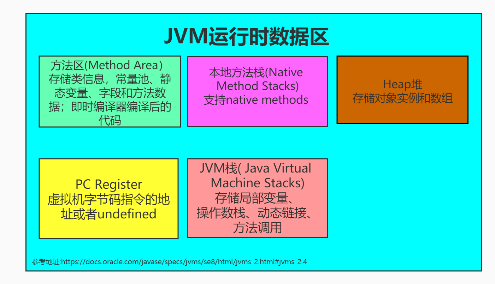

# JVM

### 1. JVM运行时数据区

****

JDK1.8：

线程私有: PC 程序计数器 、 JVM虚拟机栈、本地方法栈

线程共享: 堆Heap、方法区

### 2. 判断一个对象是否死亡？

- 引用计数器
- 根搜索算法(可达性算法)

#### 2.1 引用计数器

给对象添加一个<<引用计数器>>,每次当一个地方引用该对象的时候，就给<<引用计数器>>值+1；当引用失效的时候，就给<<引用计数器>>的值-1；当引用计数器中的值为0的时候，则证明该对象不存在任何引用。

**优点：**

- 方法实现简单
- 效率高

**缺点:**

- 引用计数器 不能解决对象之间的**循环引用**，所有目前流行的虚拟机中都没有采用该方式来管理内存

**对象之间的循环引用**

```java
public class ReferenceCountingGc {
    Object instance = null;
	public static void main(String[] args) {
        // objA 是存放在JVM虚拟机栈中
        // new ReferenceCountingGc()是ReferenceCountingGc的一个实例，存放在 堆heap中
        // objA 指针 → 堆heap中
		ReferenceCountingGc objA = new ReferenceCountingGc();
		ReferenceCountingGc objB = new ReferenceCountingGc();
        // 这里 objA.instance 指向了objB
		objA.instance = objB;
        // 这里 objB.instance 指向了objA        
		objB.instance = objA;
		objA = null;
		objB = null;
	}
}
```


#### 2.2 根搜索算法(可达性算法)

根搜索算法又名可达性算法，就是将一系列为**<<GC Roots>>**的对象作为起始点，向下开始查找，节点走过的路径成为**“引用链”**，如果一个对象与GC Roots节点之间不存在任何引用，则说明该对象不可用，可以进行回收。

#### 2.2.1 一下对象可以作为GC Roots:

- 虚拟机栈中引用的对象
- 本地方法栈中引用的对象
- 方法区中的静态属性引用的对象
- 方法区中常量引用的对象

### 3. 引用

不管是通过<<引用计数器>>还是<<根搜索算法>>来判断一个对象是否死亡，判断一个对象的死亡都和**引用**有关系。

**引用**分为:(强度依次减弱)

- 强引用(StrongReference)
- 软引用(SoftReference)
- 弱引用(WeakReference)
- 虚引用(PhantomReference)

#### 3.1 强引用

我们使用的大部分引用实际上都是**强引用**，如Object objA = new Object();如果一个对象具有强引用，等价于我们生活中**必不或缺**的生活用品

---

垃圾回收器是不会回收它的。当内存空间不足时，Java虚拟机宁愿抛出OOM错误，从而停止应用程序，也不会靠随意回收强引用的对象来解决OOM问题。

#### 3.2 软引用

如果一个对象只具有软引用，等价于我们生活中**可有可无**的生活用品。

---

如果内存空间足够的话，垃圾回收器不会回收具有软引用的对象；只有在内存不足的情况下，垃圾回收器才会回收这些对象的内存。只要垃圾回收器没有回收它，该对象就可以被程序使用。

软引用可用来实现内存敏感的高速缓存。

#### 3.3 弱引用

弱引用和软引用类似，如果一个对象只具有弱引用，等价于我们生活中**可有可无的**生活用品。

与软引用相比，具有弱引用的对象拥有更短暂的生命周期。

----

垃圾回收器只要发现只具有弱引用的对象，不管内存是否足够，都会进行回收。因为垃圾回收器是一个优先级很低的线程，所以不一定很快的发现具有弱引用的对象。

#### 3.4 虚引用

**虚引用**顾名思义，就是形同虚设，与其他几种引用都不同，虚引用并不会决定对象的生命周期。

虚引用必须和引用队列(ReferenceQuence)联合使用。当垃圾回收器准备回收一个对象是，如果发现它还有虚引用，就会在回收对象的内存之前，把这个虚引用加入到与之关联的引用队列中。程序可以通过判断引用队列中是否已经加入了虚引用，来了解被引用的对应是否将要被垃圾回收器回收。

如果程序发现了某个虚引用已经被加入到引用队列中，那么就可以在所引用的对象内存被垃圾回收器回收之前采取必要的行动。

----

如果一个对象只具有虚引用，那么它就和没有任何引用是一样的，任何时候都可以被垃回收器给回收。

**虚引用主要是用来跟踪对象被垃圾回收的活动**

**特别注意**

在程序设计中很少使用<<弱引用>>、<<虚引用>>，<<软引用>>使用的情况比较多，因为<<软引用>>可以加速JVM对垃圾内存的回收速度，可以维护系统的运行安全，防止OOM等问题的产生。

### 4. 如何判断一个类是无用的类？如何判断一个常量是废弃常量？

#### 4.1 判断一个常量是废弃的常量？

运行时常量池主要回收的是废弃的常量

- 没有String对象引用常量池中的字符串常量，则证明常量池中的该字符串常量是废弃常量，则可以被垃圾回收器进行回收

#### 4.2判断一个类是无用的类？

- 该类的所有实例已经被回收，也就是Java heap堆内存中不存在该对象的任何实例
- 加载该类的类加载器ClassLoader已经被回收
- 该类对应的java.lang.Class对象没有任何地方被引用，也就是在任何地方无法通过反射访问该类的方法

### 5. 垃圾收集算法

垃圾收集算法中包括以下几种算法：

- 标记-清除算法
- 复制算法
- 标记-整理算法
- 分代收集算法

#### 5.1 标记-清除算法

标记-清除算法，该算法为两个阶段，分别为"标记"、"清除"两个阶段；该算法是最基础的算法，后面的算法都是进行该算法的不足进行改进。以下是标记-清除算法的两个阶段：

<1> 遍历所有对象，标记出所有不需要进行回收的对象

<2> 标记完成之后，统一进行回收没有被标记的对象

**缺点**

- 效率问题，因为需要遍历全部对象进行标记
- 空间问题，标记清除对象之后的内存空间是不连续的碎片，无法进行整理，导致内存大的对象无法分配到足够的连续内存，从而提前触发GC，甚至是Stop The World。

#### 5.2 复制算法

针对标记-清除算法 产生的效率问题，复制算法应用而生。核心思想就是将内存分为大小相同的两块，每次都只使用其中的一块。当这一块内存使用完后，就将该内存中存活的对象复制到另一块去，然后再把使用的空间全部一次性清理掉。这样就使每次的内存回收都是对内存区间的一半进行回收。

该方法解决了效率问题。

**缺点**

- 效率问题： 若内存中对象存活率比较高的时候，复制对象到另一半内存时，复制操作的次数比较多，效率低
- 空间问题： 与"标记-清除算法"相比，内存缩小了一半；

#### 5.3 分代收集算法

**当前虚拟机中的垃圾收集都采用分代收集算法**，核心思想是根据对象存活周期的不同将内存为几块。一般将 Java Heap堆内存分为**新生代**和**老年代**，这种方式的优点是可以根据各个年代的特点选择不同的垃圾收集算法进行回收。

**特点**

新生代：新生代对象的特点是"朝生夕死"，每次收集对象时都会有大量的对象死去，所有选择"复制算法"，使用"空间换时间"的策略，只需要付出少量对象的复制成本就可以完成每次垃圾收集。

老年代：老年代对象的特点是"存活时间比较长"，而且没有多余的内存空间对其进行分配担保，所以必须选择"标记-清除算法"或者"标记-整理算法"。

HotSpot中就采用的是分代收集算法

#### 5.4 标记-整理算法

针对老年代的特点，老年代对象的特点是存活率较高也就是存活周期比较长，提出了一个"标记-整理算法"，分为两个阶段：标记和整理；标记过程仍然与“标记-清除算法”的标记过程是一样的，标记完成之后，进行整理操作，后续步骤不是将标记的对象直接清除，而是将标记的所有存活对象向一端进行移动，然后直接清理掉端边界之外的内存。

----

### 6. 垃圾回收器

第#5只是介绍了垃圾回收器的4种算法，垃圾收集器是内存回收的具体实现，主要有7中垃圾收集器

主要介绍下面2中：Serial 收集器 和ParNew 收集器

----

#### 6.1 Serial 收集器

Serial(串行)收集器是最基本、历史最悠久的垃圾收集器。Serial串行收集器是单线程的收集器，意味着

Serial串行收集器在垃圾回收过程中只会使用一条垃圾收集线程来完成收集工作，更重要的是它在收集过程中必须要暂停其他所有的工作线程(Stop The World)，直到它收集结束。

该收集器的一个明显缺点就是： 卡顿

优点：简单而且高效，因为没有线程交互的开销，故单线程收集效率很高

**收集算法: 分代收集算法（新生代：复制算法；老年代：标记-整理算法）**

参数:

 "**-XX:+UseSerialGC**" : 添加该参数来显示的使用串行垃圾收集器

----

#### 6.2 ParNew收集器

ParNew收集器是Serial垃圾收集器的多线程版本，除了使用多线程进行垃圾收集外，其余的行为和Serial收集器是完全一样。

运行在Server模式下的虚拟机的首要选择

**收集算法: 分代收集算法（新生代：复制算法；老年代：标记-整理算法）**

参数：
 "**-XX:+UseParNewGC**"： 强制使用ParNew垃圾回收器

----