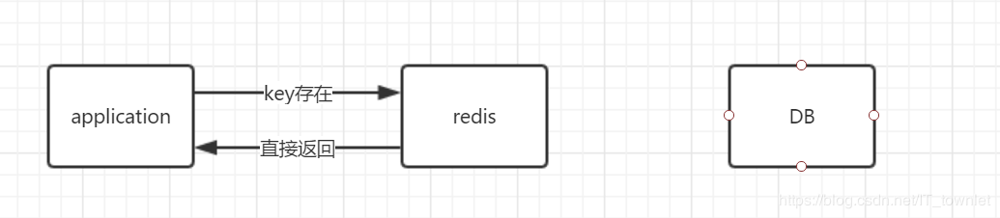
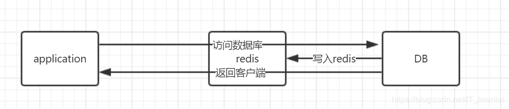
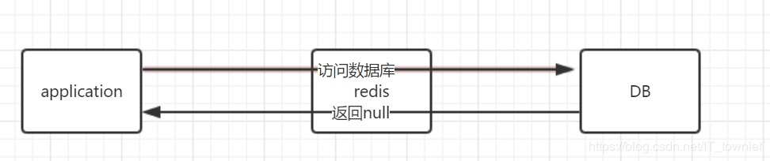
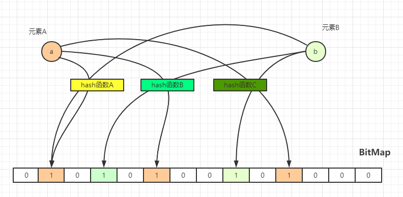

# Redis 进阶

### 1. 缓存穿透

### 1.1 定义:

请求key对应的数据在redis中不存在并且在db中也不存在；若有大量并发请求过来，请求数据key对应的数据在redis中不存在，请求会全部到db去查找，从而压垮数据库

----

应用程序中缓存访问流程:

```markdown
① : Application访问Redis, 假如数据存在，则直接返回结果.
```



```markdown
② : 数据在Redis中不存在，则直接访问DB，在DB中查询到目标值，写入Redis并返回Applicaion.
```



```markdown
③ : 数据在Redis中不存在，DB中也不存在，返回空(null);Redis中是不会写Null值, 若反复发送同一条请数据请求，则会发生缓存穿透;
```



#### 1.2 如何解决这种问题？

- BloomFilter 布隆过滤器
- 将空对象缓存到redis中，设置一个很短的过期时间

#### 1.3 Bloom Filter 布隆过滤器实现原理

Bloom Filter的特点:

- **如果布隆过滤器判断元素存在，则不一定存在，如果不存在，则一定不存在**
- Bloom Filter始终存在一个误判率，为什么？因为hash碰撞是始终存在的
- 默认的误判率是0.03

实现原理:



如上图所示:  初始化一个长度为m的BitMap，每一位位置都是0；

元素a 分别经过hash函数A、hash函数B、hash函数C之后得到一个hash值，在用函数值与BitMap的长度进行取模运算之后得到在BitMap中的索引下标，并将其值由0 → 1；这样我们就认为这个数据存在于BitMap中；

同样，元素b分别多个hash函数之后，也将其在BitMap中对应的索引位置上的只由0 → 1；就可能发生1个位置被多次置为1，只有第一次起作用，出现这样的情况是因为hash碰撞的存在

所以Boolm Filter中判断一个元素存在，则实际不一定存在；但判断一个元素不存在，则一定不存在

**Bloom Filter不支持元素删除**
现在有很多Bloom Filter实现了元素删除。如Count Bloom Filter

很多工具中都已经存在实现了Bloom Filter。如Google的 Guava

---

### 2. 缓存雪崩

#### 2.1 定义:

当Redis缓存服务器重启或者大量缓存集中在某一个时间段内失效时，请求到达之后，发现redis缓存中不存在对应的缓存，会直接从数据库中进行查询，高并发场景之下，会直接压垮数据库

#### 2.2 如何解决这种问题?

- 在redis中缓存数据的时候，给过期时间加一个随机值，这样可以减少redis中缓存在同一时间集体失效。
- 采用多级缓存 + 限流:  request → redis → memcache → db；
- 可以采用redis哨兵模式、redis集群模式，尽可能的降低redis挂掉的情况

### 3. 缓存 和 DB 双写一直问题

#### 3.1 读操作

<读操作>的一个常规套路：

- 数据在缓存中存在，则直接从缓存中获取数据
- 数据在缓存中不存在，先去查询数据库，将查询结果写入到redis缓存中，最后将数据返回给请求

#### 3.2 更新操作

##### 3.2.1 redis 和 db 的双写一致问题是什么？

双写一致问题： 如果仅仅是用作查询的话，redis和db是没有问题的；但是，当我们更新的时候，就会造成**db和redis中的数据不一致**。

==========================================================================================================================================

理论而言：只要我们在redis中存储数据时，设置key的过期时间，我们就可以保证db和redis中的数据最终是一致的。只要redis中key过期的话，该数据就会从redis中被删除，请求会直接去数据库查询，然后将查询结果写入到redis缓存中。

##### 3.2.2 更新操作

一般而言，更新操作都会有2中选择：

+ <1> 先操作缓存，在操作db
+ <2> 先操作db，在操作缓存

不管哪种选择，我们都希望这两个操作**同时成功或者同时失败**，这样做是可以保证原子性；

如果原子性被破坏就会发生下面的问题：

- db操作成功，redis操作失败【双写不一致】
- db操作失败，redis操作成功【双写不一致】

------

**redis操作**：

- 删除redis中指定key的缓存
- 更新redis中指定key的缓存

一般建议直接删除redis中指定key的缓存，原因：

- 数据库更新操作 + 缓存更新操作，非常容易诱发redis和db的双写不一致问题
- 性能原因：如果更新数据库之后，每次都需要更新缓存，操作如果频繁的话，会存在性能问题，还不如直接删除redis中的key，让请求直接去数据库中去查找，然后将数据放入到redis缓存中，这样可以直接保证db和redis中的数据一致

---

**更新操作<1>: 先操作db，在删除redis缓存**

正常情况:  

- 先操作db，成功
- 在操作redis，成功

如何 不能保证原子性的话，可能存在场景：

- 第一步操作DB失败了，我们直接Exception就行；这样不存在db和redis中双写不一致的情况
- 第一步操作DB成功了，第二步骤删除redis缓存失败了； 这存在双写不一致问题，db中是新数据，redis缓存中是旧数据；

----

**针对删除redis缓存失败的解决办法**:

- 可以将redis中需要删除的key，加入到一个消息队列中；
- 自己消费消息，获取需要删除的key，不断的进行重试删除缓存操作，直到成功

---

**更新操作<2>: 先删除缓存, 在操作db**

正常情况：

- 先删除缓存，成功
- 在操作db，成功

如果不能保证原子性，可能存在以下情况：

- 第一步删除缓存失败了，我们可以直接扔出Exception，这种情况数据库和缓存中数据还是一致的
- 第一步删除缓存成功，第二步操作DB失败，这种情况数据库和缓存中数据还是一致的

**这种情况看起来是很完美的，但是在高并发下，还是存在db和缓存中双写不一致的场景**

高并发场景： 

- 线程A删除缓存
- 线程B发现缓存已经不存在，直接去数据库进行查询，得到一个旧值，并将其写入到缓存中
- 线程A将一个新值写入到数据库，这种情况就存在db和缓存中双写不一致的场景

---

**针对上面的双写不一致的情况，解决办法**：

- 将 删除redis缓存 、操作数据库、读取缓存加入到一个操作队列中，实现串行化，保证每个动作都是FIFO先进先出

---

#### 3.3.3 两种更新操作的对比:

- 先删除缓存，在操作DB：

  - 高并发下，表现不如意；在原子性被破坏的情况下，表现优异

- 先操作DB，在删除缓存(CAP设计模式)：

  - 高并发下表现优异，在原子性被破坏时，表现不如意
  - 实际情况下，推荐这种，这种在真实情况下发生的

### 4. Redis 分布式锁

#### 4.1 Redis单实例实现分布式锁


