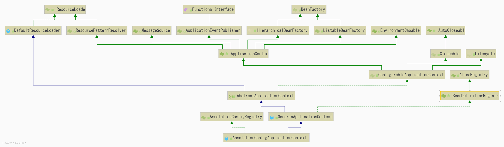

# Spring 源码学习

> [!Note|label:创建Test程序]
```java
// 只介绍使用注解版配置文件
@Test
public void testIOC() {
    AnnotationConfigApplicationContext annotationConfigApplicaionContext = new AnnotationConfigApplicationContext(AppConfig.class);
    UserController userController = annotationConfigApplicaionContext.getBean(UserController.class);
    User user = userController.login(1);
    System.out.println(user);
}
```
#### Spring整体脉络图

#### 源码解析

> [!Warning|label:AnnotationConfigApplicationContext类图]
> 


> [!Note|label:AnnotationConfigApplicationContext源码解析]
```java
/**
 * 创建一个AnnotationConfigApplicationContext上下文对*象，从给定的配置类中读取Bean的定义信息，并刷新上下文
 */
public AnnotationConfigApplicationContext(Class<?>... componentClasses) {
    /**
     * 调用无参构造器,创建BeanDefinition的扫描器并且创建BeanFactory
     */
    this();
    // 注册配置类
    register(componentClasses);
    // 核心方法: 刷新ApplicationContext上下文
    refresh();
}

=================== this() 方法调用流程 =============
/**
 * 由于AnnotationConfigApplicationContext.class继承了GenericApplicationContext.class 类，首先会调用父类的无参构造器
 */

// 父类构造器 org.springframework.context.support.GenericApplicationContext#GenericApplicationContext()
public GenericApplicationContext() {
    /**
     * 创建BeanFactory，主要目的就是用于生产和管理Bean
     */
    this.beanFactory = new DefaultListableBeanFactory();
}

// 当前类无参构造器 org.springframework.context.annotation.AnnotationConfigApplicationContext#AnnotationConfigApplicationContext()
public AnnotationConfigApplicationContext() {
    // 基于注解的BeanDefinition的读取器
    this.reader = new AnnotatedBeanDefinitionReader(this);
    // 创建BeanDefinition扫描器，基于XML文件的包扫描器
    this.scanner = new ClassPathBeanDefinitionScanner(this);
}
====================================================
```

> [!Note|label:Refresh方法是Spring的核心方法]   
> - **AbstractApplicationContext中的refresh()方法是Spring框架的核心;**
> - Refresh()方法总共可以分为12步骤，核心步骤finishBeanFactoryInitialization()

```java
org.springframework.context.support.AbstractApplicationContext#refresh

@Override
public void refresh() throws BeansException, IllegalStateException {
    synchronized (this.startupShutdownMonitor) {
        /**
         * <1> 准备刷新阶段；
         * 设置开始时间，创建Environment环境变量，以及实例化一些用于存储监听器的集合
         */
        prepareRefresh();
        
        /**
         * <2> 获取BeanFactory,设置BeanFactory的ID属性
         * 涉及CAS操作，判断当前BeanFactory是否已经刷新过
         */
        ConfigurableListableBeanFactory beanFactory = obtainFreshBeanFactory();

        /**
         * <3> 填充BeanFactory的属性，如
         * 1. 类加载器、
         * 2. Bean表达式解析器用于解析EL表达式；
         *    如 @Value{#....}
         * 3. 增加aware后置处理器，
         * aware后置处理器的作用：是当前Bean对象可以获取当前应用程序上下文ApplicationContex
         */
        prepareBeanFactory(beanFactory);

        try {
            /**
             * 该接口尚未实现；
             * 主要作用：BeanFactory 后置处理器，用于改变BeanDefition中的信息；
             */
            postProcessBeanFactory(beanFactory);

            /**
             * <4> 实例化并调用所有BeanFactory的后置处理器，用于将通过注解
             * 扫描得到的Bean信息封装成BeanDefinition加入到BeanDefinitionMap中；
             * BeanDefinition中包含了当前Bean的各种信息，如Bean名称、是否依赖、
             * 初始化方法.....
             */
            invokeBeanFactoryPostProcessors(beanFactory);

            /**
             * <5> 实例化并注册所有的Bean后置处理器
             * 这里只是进行实例化，注册并没有进行调用；
             *  主要用于后期Bean初始化时进行调用
             */
            registerBeanPostProcessors(beanFactory);

            /**
             * <6> 加载国际化i18n等资源信息；
             * 初始化MessageSource
             */
            initMessageSource();

            /**
             * <7> 初始化应用程序事件传播器；
             * 这里使用了一种观察者的设计模式；
             */
            initApplicationEventMulticaster();

            /**
             * 没有实现
             */
            onRefresh();

            /**
             * <8> 注册监听器
             */
            registerListeners();

            /**
             * <9> 实例化剩余非懒加载的单例Bean
             */
            finishBeanFactoryInitialization(beanFactory);

            /**
             * <10> 刷新完成工作，包括初始化LifecycleProcessor，发布刷新完成事件等
             */
            finishRefresh();
        }

        catch (BeansException ex) {
            if (logger.isWarnEnabled()) {
                logger.warn("Exception encountered during context initialization - " +
                        "cancelling refresh attempt: " + ex);
            }

            // Destroy already created singletons to avoid dangling resources.
            destroyBeans();

            // Reset 'active' flag.
            cancelRefresh(ex);

            // Propagate exception to caller.
            throw ex;
        }

        finally {
            /**
             * <11> 重置Spring公共的缓存
             * declaredMethodsCache、declaredFieldsCache ....
             */
            resetCommonCaches();
        }
    }
}
```

> [!Warning|label:重点介绍finishBeanFactoryInitialization方法]  
> - 这里着重分析finishBeanFactoryInitialization()，该方法中实现了Spring的核心功能AOP(面向切换编程)和IOC(控制反转)以及DI(依赖注入)

```java
org.springframework.context.support.AbstractApplicationContext#finishBeanFactoryInitialization

/**
 * 完成Bean Factory的初始化，和所有单例Bean的初始化工作
 */ 
protected void finishBeanFactoryInitialization(ConfigurableListableBeanFactory beanFactory) {

    /**
     * 实例化上下文的conversion service
     * 实例化转换服务，如字段类型转换，对象转换
     * 依赖注入时，可用于类型转换
     */ 
    if (beanFactory.containsBean(CONVERSION_SERVICE_BEAN_NAME) &&
            beanFactory.isTypeMatch(CONVERSION_SERVICE_BEAN_NAME, ConversionService.class)) {
        beanFactory.setConversionService(
                beanFactory.getBean(CONVERSION_SERVICE_BEAN_NAME, ConversionService.class));
    }

    /**
     * 判断beanFactory中是否存在一个嵌入值解析器,不存在的话，则添加一个嵌入值解析器，主要用于解析属性表达式中的占位符
     * 如：@value(#{})
     */ 
    if (!beanFactory.hasEmbeddedValueResolver()) {
        // 添加一个嵌入值解析器
        beanFactory.addEmbeddedValueResolver(strVal -> getEnvironment().resolvePlaceholders(strVal));
    }

    String[] weaverAwareNames = beanFactory.getBeanNamesForType(LoadTimeWeaverAware.class, false, false);
    for (String weaverAwareName : weaverAwareNames) {
        getBean(weaverAwareName);
    }

    // 设置临时类加载器
    beanFactory.setTempClassLoader(null);

    /**
     * 将所有的BeanDefinition的metadata进行缓存，保证不被修改；
     * 主要就是将bean 定义的名称进行缓存
     * 底层:
     * this.frozenBeanDefinitionNames = StringUtils.toStringArray(this.beanDefinitionNames);
     */ 
    beanFactory.freezeConfiguration();

    /**
     * <p>
     *  <b>实例化剩余的单实例Bean</b>
     * </p>
     */ 
    beanFactory.preInstantiateSingletons();
}
```

> [!Warning|label:preInstantiateSingletons方法调用详细流程]
```java
@Override
public void preInstantiateSingletons() throws BeansException {
    if (logger.isTraceEnabled()) {
        logger.trace("Pre-instantiating singletons in " + this);
    }

    // 获取容器中所有的Bean定义的名称
    List<String> beanNames = new ArrayList<>(this.beanDefinitionNames);

    // 循环创建所有的Bean实例对象
    for (String beanName : beanNames) {
        // 合并我们的bean定义
        RootBeanDefinition bd = getMergedLocalBeanDefinition(beanName);

        /**
         * 根据bean定义判断是不是抽象的 && 是单例的 && 不是懒加载的
         */
        if (!bd.isAbstract() && bd.isSingleton() && !bd.isLazyInit()) {
            // 判断当前bean是否是FactoryBean，依据当前bean是否实现了FactoryBean接口
            if (isFactoryBean(beanName)) {
                // 是的话， 给beanName+前缀&符号
                Object bean = getBean(FACTORY_BEAN_PREFIX + beanName);

                if (bean instanceof FactoryBean) {
                    final FactoryBean<?> factory = (FactoryBean<?>) bean;
                    boolean isEagerInit;
                    if (System.getSecurityManager() != null && factory instanceof SmartFactoryBean) {
                        isEagerInit = AccessController.doPrivileged((PrivilegedAction<Boolean>)
                                        ((SmartFactoryBean<?>) factory)::isEagerInit,
                                getAccessControlContext());
                    }
                    else {
                        isEagerInit = (factory instanceof SmartFactoryBean &&
                                ((SmartFactoryBean<?>) factory).isEagerInit());
                    }
                    if (isEagerInit) {
                        // 调用真正的getBean的流程
                        getBean(beanName);
                    }
                }
            }
            else {
                /**
                 * <p>
                 *   <b>非工厂bean，普通bean</b>
                 * </p>
                 */ 
                getBean(beanName);
            }
        }
    }

    /**
     * <1> 判断IOC容器中的Bean是否实现SmartInitializingSingleton接口，如果实现接口，则回调起afterSingletonsInstantiated方法,作为一个后置处理操作
     * <2> 到这里所有的单实例的bean已经加载到单例缓存池(singleObjects)中
     */
    for (String beanName : beanNames) {
        // 从单例缓存池中获取beanName对象
        Object singletonInstance = getSingleton(beanName);
        // 判断当前对象是否实现了SmartInitializingSingleton接口
        if (singletonInstance instanceof SmartInitializingSingleton) {
            final SmartInitializingSingleton smartSingleton = (SmartInitializingSingleton) singletonInstance;
            if (System.getSecurityManager() != null) {
                AccessController.doPrivileged((PrivilegedAction<Object>) () -> {
                    smartSingleton.afterSingletonsInstantiated();
                    return null;
                }, getAccessControlContext());
            }
            else {
                smartSingleton.afterSingletonsInstantiated();
            }
        }
    }
}
```

> [!Warning|label:getBean调用流程]
> - getBean() 方法主要逻辑流程:
>   1. 先判断当前单例缓存池singletonObjects中是否含有已经创建好的对象，有则返回，无则进行创建
>   2. 创建Bean实例对象之前先对其做一个检查，如@dependOn依赖其他Bean的检查，注册其与其他bean之间的依赖关系
>   3. 创建Bean实例(createBeanInstance)，通过Java反射方法construct.newInstance()创建一个Bean实例对象，此时当前Bean实例对象的所有属性全部为null
>   4. Bean实例属性填充(populateBean), 属性填充时，设计DI依赖注入操作
>   5. 初始化Bean实例(initializeBean);
>       - Spring的另一个核心功能AOP就是此处实现
>       - 主要是用过调用init方法来Bean实例进行初始化操作
>       - 调用后置处理器对其创建的Bean实例对象进行一些特殊操作

```java
/**
 * Spring 中实际处理流程都是以doxxx形式定义方法名
 */
@Override
public Object getBean(String name) throws BeansException {
    return doGetBean(name, null, null, false);
}
```

```java
/**
 * 返回一个Bean实例对象
 */
@SuppressWarnings("unchecked")
protected <T> T doGetBean(final String name, @Nullable final Class<T> requiredType,
        @Nullable final Object[] args, boolean typeCheckOnly) throws BeansException {

    // 转换别名
    final String beanName = transformedBeanName(name);
    Object bean;

    // 从单例缓存池中获取Bean实例对象
    Object sharedInstance = getSingleton(beanName);
    if (sharedInstance != null && args == null) {
        if (logger.isTraceEnabled()) {
            if (isSingletonCurrentlyInCreation(beanName)) {
                logger.trace("Returning eagerly cached instance of singleton bean '" + beanName +
                        "' that is not fully initialized yet - a consequence of a circular reference");
            }
            else {
                logger.trace("Returning cached instance of singleton bean '" + beanName + "'");
            }
        }
        bean = getObjectForBeanInstance(sharedInstance, name, beanName, null);
    }

    else {
        // prototype 类型的Bean 实例是否正在创建中
        if (isPrototypeCurrentlyInCreation(beanName)) {
            throw new BeanCurrentlyInCreationException(beanName);
        }

        /**
         * 判断是否存在父的beanFactory
         * 这里涉及到spring mvc中的父子容器
         */ 
        BeanFactory parentBeanFactory = getParentBeanFactory();
        if (parentBeanFactory != null && !containsBeanDefinition(beanName)) {
            // Not found -> check parent.
            String nameToLookup = originalBeanName(name);
            if (parentBeanFactory instanceof AbstractBeanFactory) {
                return ((AbstractBeanFactory) parentBeanFactory).doGetBean(
                        nameToLookup, requiredType, args, typeCheckOnly);
            }
            else if (args != null) {
                // Delegation to parent with explicit args.
                return (T) parentBeanFactory.getBean(nameToLookup, args);
            }
            else if (requiredType != null) {
                // No args -> delegate to standard getBean method.
                return parentBeanFactory.getBean(nameToLookup, requiredType);
            }
            else {
                return (T) parentBeanFactory.getBean(nameToLookup);
            }
        }

        if (!typeCheckOnly) {
            // 标记当前的beanName为正在创建状态
            markBeanAsCreated(beanName);
        }

        try {
            final RootBeanDefinition mbd = getMergedLocalBeanDefinition(beanName);
            checkMergedBeanDefinition(mbd, beanName, args);

            /**
             * 检查当前Bean依赖的Bean是否已经创建，没有则先创建依赖的Bean实例,即判断当前Bean是否含有@dependOn注解
             */
            String[] dependsOn = mbd.getDependsOn();
            if (dependsOn != null) {
                for (String dep : dependsOn) {
                    if (isDependent(beanName, dep)) {
                        throw new BeanCreationException(mbd.getResourceDescription(), beanName,
                                "Circular depends-on relationship between '" + beanName + "' and '" + dep + "'");
                    }
                    // 注册Bean所依赖的Bean
                    registerDependentBean(dep, beanName);
                    try {
                        getBean(dep);
                    }
                    catch (NoSuchBeanDefinitionException ex) {
                        throw new BeanCreationException(mbd.getResourceDescription(), beanName,
                                "'" + beanName + "' depends on missing bean '" + dep + "'", ex);
                    }
                }
            }

            // 创建Bean实例；Bean的作用域为单例，即默认作用域
            if (mbd.isSingleton()) {
                sharedInstance = getSingleton(beanName, () -> {
                    try {
                        /**
                         * <p><b>核心方法:创建Bean</b></p>
                         */
                        return createBean(beanName, mbd, args);
                    }
                    catch (BeansException ex) {
                        // 创建Bean时发生异常，则销毁Bean
                        destroySingleton(beanName);
                        throw ex;
                    }
                });
                bean = getObjectForBeanInstance(sharedInstance, name, beanName, mbd);
            }
            // Bean的作用域为prototype
            else if (mbd.isPrototype()) {
                Object prototypeInstance = null;
                try {
                    beforePrototypeCreation(beanName);
                    prototypeInstance = createBean(beanName, mbd, args);
                }
                finally {
                    afterPrototypeCreation(beanName);
                }
                bean = getObjectForBeanInstance(prototypeInstance, name, beanName, mbd);
            }
            // 其他作用域
            else {
                String scopeName = mbd.getScope();
                final Scope scope = this.scopes.get(scopeName);
                if (scope == null) {
                    throw new IllegalStateException("No Scope registered for scope name '" + scopeName + "'");
                }
                try {
                    Object scopedInstance = scope.get(beanName, () -> {
                        beforePrototypeCreation(beanName);
                        try {
                            return createBean(beanName, mbd, args);
                        }
                        finally {
                            afterPrototypeCreation(beanName);
                        }
                    });
                    bean = getObjectForBeanInstance(scopedInstance, name, beanName, mbd);
                }
                catch (IllegalStateException ex) {
                    throw new BeanCreationException(beanName,
                            "Scope '" + scopeName + "' is not active for the current thread; consider " +
                            "defining a scoped proxy for this bean if you intend to refer to it from a singleton",
                            ex);
                }
            }
        }
        catch (BeansException ex) {
            cleanupAfterBeanCreationFailure(beanName);
            throw ex;
        }
    }

    // 检查类型是否匹配，不匹配则进行类型转换
    if (requiredType != null && !requiredType.isInstance(bean)) {
        try {
            T convertedBean = getTypeConverter().convertIfNecessary(bean, requiredType);
            if (convertedBean == null) {
                throw new BeanNotOfRequiredTypeException(name, requiredType, bean.getClass());
            }
            return convertedBean;
        }
        catch (TypeMismatchException ex) {
            if (logger.isTraceEnabled()) {
                logger.trace("Failed to convert bean '" + name + "' to required type '" +
                        ClassUtils.getQualifiedName(requiredType) + "'", ex);
            }
            throw new BeanNotOfRequiredTypeException(name, requiredType, bean.getClass());
        }
    }
    // 返回创建的Bean实例
    return (T) bean;
}
```

> [!Warning|label:创建Bean实例的核心方法createBean]
> createBean()是doGetBean()中的核心，从单例缓存池singletonObjects中获取Bean实例对象，若不存在，则进行创建Bean实例

```java
org.springframework.beans.factory.support.AbstractAutowireCapableBeanFactory#createBean

/**
 * 核心方法;
 * <1> 创建Bean实例
 * <2> 填充属性
 * <3> 应用后置处理器
 */
@Override
protected Object createBean(String beanName, RootBeanDefinition mbd, @Nullable Object[] args)
    throws BeanCreationException {

if (logger.isTraceEnabled()) {
    logger.trace("Creating instance of bean '" + beanName + "'");
}
RootBeanDefinition mbdToUse = mbd;

// 解析Bean得到Bean的Class对象
// 等价于 Class clazz = Class.forName(com.springframework.cn.web.UserController);
Class<?> resolvedClass = resolveBeanClass(mbd, beanName);
if (resolvedClass != null && !mbd.hasBeanClass() && mbd.getBeanClassName() != null) {
    mbdToUse = new RootBeanDefinition(mbd);
    mbdToUse.setBeanClass(resolvedClass);
}

// 准备重写方法
try {
    mbdToUse.prepareMethodOverrides();
}
catch (BeanDefinitionValidationException ex) {
    throw new BeanDefinitionStoreException(mbdToUse.getResourceDescription(),
            beanName, "Validation of method overrides failed", ex);
}

try {
    // 实例化之前，调用后置处理器
    Object bean = resolveBeforeInstantiation(beanName, mbdToUse);
    if (bean != null) {
        return bean;
    }
}
catch (Throwable ex) {
    throw new BeanCreationException(mbdToUse.getResourceDescription(), beanName,
            "BeanPostProcessor before instantiation of bean failed", ex);
}

try {
    // 创建Bean实例对象
    Object beanInstance = doCreateBean(beanName, mbdToUse, args);
    if (logger.isTraceEnabled()) {
        logger.trace("Finished creating instance of bean '" + beanName + "'");
    }
    // 返回创建的Bean实例对象
    return beanInstance;
}
catch (BeanCreationException | ImplicitlyAppearedSingletonException ex) {
    throw ex;
}
catch (Throwable ex) {
    throw new BeanCreationException(
            mbdToUse.getResourceDescription(), beanName, "Unexpected exception during bean creation", ex);
}
}
```

> [!Warning|label:doCreateBean方法源码解析]
> - 核心方法有3个分别为:
>   - <1> createBeanInstance() 创建Bean实例对象，所有属性全部为null
>   - <2> populateBean 填充Bean实例属性,DI的实现
>   - <3> initializeBean 初始化，或者应用后置处理器生成代理对象，AOP的实现

```java
/**
 * 创建Bean实例对象；
 */
protected Object doCreateBean(final String beanName, final RootBeanDefinition mbd, final @Nullable Object[] args)
        throws BeanCreationException {

    // Instantiate the bean.
    BeanWrapper instanceWrapper = null;
    if (mbd.isSingleton()) {
        // 从FactoryBean实例缓存中移除没有创建完成的Bean实例对象
        instanceWrapper = this.factoryBeanInstanceCache.remove(beanName);
}
    if (instanceWrapper == null) {
    // 创建Bean实例对象，返回一个被封装过的Bean实例对象
    instanceWrapper = createBeanInstance(beanName, mbd, args);
}
    final Object bean = instanceWrapper.getWrappedInstance();
    Class<?> beanType = instanceWrapper.getWrappedClass();
    if (beanType != NullBean.class) {
        mbd.resolvedTargetType = beanType;
    }

    // Allow post-processors to modify the merged bean definition.
    synchronized (mbd.postProcessingLock) {
        if (!mbd.postProcessed) {
            try {
                //调用属性合并后置处理器, 进行属性合并
                //这里会进行 一些注解 的扫描
                //CommonAnnotationBeanPostProcessor -> @PostConstruct @PreDestroy @Resource
                //AutowiredAnnotationBeanPostProcessor -> @Autowired @Value
                applyMergedBeanDefinitionPostProcessors(mbd, beanType, beanName);
            }
            catch (Throwable ex) {
                throw new BeanCreationException(mbd.getResourceDescription(), beanName,
                        "Post-processing of merged bean definition failed", ex);
            }
            mbd.postProcessed = true;
        }
    }

    // 将获取的Bean实例对象加入到一级缓存中
    boolean earlySingletonExposure = (mbd.isSingleton() && this.allowCircularReferences &&
            isSingletonCurrentlyInCreation(beanName));
    if (earlySingletonExposure) {
        if (logger.isTraceEnabled()) {
            logger.trace("Eagerly caching bean '" + beanName +
                    "' to allow for resolving potential circular references");
        }
        addSingletonFactory(beanName, () -> getEarlyBeanReference(beanName, mbd, bean));
    }

    // 初始化Bean实例对象
    Object exposedObject = bean;
    try {
        // 填充Bean实例属性
        populateBean(beanName, mbd, instanceWrapper);
        // 初始化Bean实例对象，调用后置处理器生成代理对象(AOP实现)
        exposedObject = initializeBean(beanName, exposedObject, mbd);
    }
    catch (Throwable ex) {
        if (ex instanceof BeanCreationException && beanName.equals(((BeanCreationException) ex).getBeanName())) {
            throw (BeanCreationException) ex;
        }
        else {
            throw new BeanCreationException(
                    mbd.getResourceDescription(), beanName, "Initialization of bean failed", ex);
        }
    }

    if (earlySingletonExposure) {
        Object earlySingletonReference = getSingleton(beanName, false);
        if (earlySingletonReference != null) {
            if (exposedObject == bean) {
                exposedObject = earlySingletonReference;
            }
            else if (!this.allowRawInjectionDespiteWrapping && hasDependentBean(beanName)) {
                String[] dependentBeans = getDependentBeans(beanName);
                Set<String> actualDependentBeans = new LinkedHashSet<>(dependentBeans.length);
                for (String dependentBean : dependentBeans) {
                    if (!removeSingletonIfCreatedForTypeCheckOnly(dependentBean)) {
                        actualDependentBeans.add(dependentBean);
                    }
                }
                if (!actualDependentBeans.isEmpty()) {
                    throw new BeanCurrentlyInCreationException(beanName,
                            "Bean with name '" + beanName + "' has been injected into other beans [" +
                            StringUtils.collectionToCommaDelimitedString(actualDependentBeans) +
                            "] in its raw version as part of a circular reference, but has eventually been " +
                            "wrapped. This means that said other beans do not use the final version of the " +
                            "bean. This is often the result of over-eager type matching - consider using " +
                            "'getBeanNamesOfType' with the 'allowEagerInit' flag turned off, for example.");
                }
            }
        }
    }

    // Register bean as disposable.
    try {
        registerDisposableBeanIfNecessary(beanName, bean, mbd);
    }
    catch (BeanDefinitionValidationException ex) {
        throw new BeanCreationException(
                mbd.getResourceDescription(), beanName, "Invalid destruction signature", ex);
    }

    return exposedObject;
}
```

> [!Warning|label:doCreateBean核心方法一createBeanInstance]

```java
/**
 * 通过合适的实例化策略，创建Bean实例;
 * 实例化策略:
 * <1> 工厂方法 factory method
 * <2> 构造器 constructor autowiring
 * <3> 简单实例化 simple instantiation.
 */
protected BeanWrapper createBeanInstance(String beanName, RootBeanDefinition mbd, @Nullable Object[] args) {
    // 解析Bean，得到一个Class类对象
    Class<?> beanClass = resolveBeanClass(mbd, beanName);

    // beanClass 不为null && beanClass的类修饰符是不是pulic
    if (beanClass != null && !Modifier.isPublic(beanClass.getModifiers()) && !mbd.isNonPublicAccessAllowed()) {
        throw new BeanCreationException(mbd.getResourceDescription(), beanName,
                "Bean class isn't public, and non-public access not allowed: " + beanClass.getName());
    }

    Supplier<?> instanceSupplier = mbd.getInstanceSupplier();
    if (instanceSupplier != null) {
        return obtainFromSupplier(instanceSupplier, beanName);
    }

    if (mbd.getFactoryMethodName() != null) {
        return instantiateUsingFactoryMethod(beanName, mbd, args);
    }

    // Shortcut when re-creating the same bean...
    boolean resolved = false;
    boolean autowireNecessary = false;
    if (args == null) {
        synchronized (mbd.constructorArgumentLock) {
            if (mbd.resolvedConstructorOrFactoryMethod != null) {
                resolved = true;
                autowireNecessary = mbd.constructorArgumentsResolved;
            }
        }
    }
    if (resolved) {
        if (autowireNecessary) {
            return autowireConstructor(beanName, mbd, null, null);
        }
        else {
            return instantiateBean(beanName, mbd);
        }
    }

    // 通过调用BeanPostProcessors Bean的后置处理器确定实例化所用的构造函数
    Constructor<?>[] ctors = determineConstructorsFromBeanPostProcessors(beanClass, beanName);
    if (ctors != null || mbd.getResolvedAutowireMode() == AUTOWIRE_CONSTRUCTOR ||
            mbd.hasConstructorArgumentValues() || !ObjectUtils.isEmpty(args)) {
        return autowireConstructor(beanName, mbd, ctors, args);
    }

    // 获取最优的构造器
    ctors = mbd.getPreferredConstructors();
    if (ctors != null) {
        return autowireConstructor(beanName, mbd, ctors, null);
    }

    // 通过无参构造器进行实例化Bean
    return instantiateBean(beanName, mbd);
}
```

> [!Note|label:instantiateBean方法底层实现]     
> instantiateBean()底层实现原理：通过反射获取构造器，在通过
construct.newInstance()实现     
> 即： Class clazz = Class.forName();   
>     Constructor cons = clazz.getDeclaredConstructor();   
>     Object obj = cons.newInstance();

```java
@Override
public Object instantiate(RootBeanDefinition bd, @Nullable String beanName, BeanFactory owner) {
    // Don't override the class with CGLIB if no overrides.
    if (!bd.hasMethodOverrides()) {
        Constructor<?> constructorToUse;
        synchronized (bd.constructorArgumentLock) {
            constructorToUse = (Constructor<?>) bd.resolvedConstructorOrFactoryMethod;
            if (constructorToUse == null) {
                final Class<?> clazz = bd.getBeanClass();
                if (clazz.isInterface()) {
                    throw new BeanInstantiationException(clazz, "Specified class is an interface");
                }
                try {
                    if (System.getSecurityManager() != null) {
                        constructorToUse = AccessController.doPrivileged(
                                (PrivilegedExceptionAction<Constructor<?>>) clazz::getDeclaredConstructor);
                    }
                    else {
                        // 通过反射方法获取构造器
                        constructorToUse = clazz.getDeclaredConstructor();
                    }
                    bd.resolvedConstructorOrFactoryMethod = constructorToUse;
                }
                catch (Throwable ex) {
                    throw new BeanInstantiationException(clazz, "No default constructor found", ex);
                }
            }
        }
        // 实例化
        return BeanUtils.instantiateClass(constructorToUse);
    }
    else {
        // Must generate CGLIB subclass.
        return instantiateWithMethodInjection(bd, beanName, owner);
    }
}

==============BeanUtils.instantiateClass=================
org.springframework.beans.BeanUtils#instantiateClass(java.lang.reflect.Constructor<T>, java.lang.Object...)

public static <T> T instantiateClass(Constructor<T> ctor, Object... args) throws BeanInstantiationException {
    Assert.notNull(ctor, "Constructor must not be null");
    try {
        ReflectionUtils.makeAccessible(ctor);
        if (KotlinDetector.isKotlinReflectPresent() && KotlinDetector.isKotlinType(ctor.getDeclaringClass())) {
            return KotlinDelegate.instantiateClass(ctor, args);
        }
        else {
            Class<?>[] parameterTypes = ctor.getParameterTypes();
            Assert.isTrue(args.length <= parameterTypes.length, "Can't specify more arguments than constructor parameters");
            Object[] argsWithDefaultValues = new Object[args.length];
            for (int i = 0 ; i < args.length; i++) {
                if (args[i] == null) {
                    Class<?> parameterType = parameterTypes[i];
                    argsWithDefaultValues[i] = (parameterType.isPrimitive() ? DEFAULT_TYPE_VALUES.get(parameterType) : null);
                }
                else {
                    argsWithDefaultValues[i] = args[i];
                }
            }
            // 实例化Bean
            return ctor.newInstance(argsWithDefaultValues);
        }
    }
    catch (InstantiationException ex) {
        throw new BeanInstantiationException(ctor, "Is it an abstract class?", ex);
    }
    catch (IllegalAccessException ex) {
        throw new BeanInstantiationException(ctor, "Is the constructor accessible?", ex);
    }
    catch (IllegalArgumentException ex) {
        throw new BeanInstantiationException(ctor, "Illegal arguments for constructor", ex);
    }
    catch (InvocationTargetException ex) {
        throw new BeanInstantiationException(ctor, "Constructor threw exception", ex.getTargetException());
    }
}
```

> [!Warning|label:doCreateBean核心方法二populateBean]   
> populateBean()方法主要用于给Bean实例对象填充属性，DI依赖注入就是在该方法中实现

```java
/**
 * 使用属性值填充Bean实例
 */ 
@SuppressWarnings("deprecation")  // for postProcessPropertyValues
protected void populateBean(String beanName, RootBeanDefinition mbd, @Nullable BeanWrapper bw) {
	if (bw == null) {
		if (mbd.hasPropertyValues()) {
			throw new BeanCreationException(
					mbd.getResourceDescription(), beanName, "Cannot apply property values to null instance");
		}
		else {
			// Skip property population phase for null instance.
			return;
		}
	}

	// Give any InstantiationAwareBeanPostProcessors the opportunity to modify the
	// state of the bean before properties are set. This can be used, for example,
	// to support styles of field injection.
	if (!mbd.isSynthetic() && hasInstantiationAwareBeanPostProcessors()) {
		for (BeanPostProcessor bp : getBeanPostProcessors()) {
			if (bp instanceof InstantiationAwareBeanPostProcessor) {
				InstantiationAwareBeanPostProcessor ibp = (InstantiationAwareBeanPostProcessor) bp;
				if (!ibp.postProcessAfterInstantiation(bw.getWrappedInstance(), beanName)) {
					return;
				}
			}
		}
	}

	PropertyValues pvs = (mbd.hasPropertyValues() ? mbd.getPropertyValues() : null);


    /**
     * 获取@Autowired的注入模式或者自动装配模式
     * 注入模式支持4中类型：
     * <1> AUTOWIRE_NO ： 默认值，不进行自动装配
     * <2> AUTOWIRE_BY_NAME ： 根据 name 自动装配
     * <3> AUTOWIRE_BY_TYPE ： 根据type 自动装配
     * <4> AUTOWIRE_CONSTRUCTOR ： 根据构造函数自动装配
     */
	int resolvedAutowireMode = mbd.getResolvedAutowireMode();
	if (resolvedAutowireMode == AUTOWIRE_BY_NAME || resolvedAutowireMode == AUTOWIRE_BY_TYPE) {
		MutablePropertyValues newPvs = new MutablePropertyValues(pvs);
		// 根据name自动装配
		if (resolvedAutowireMode == AUTOWIRE_BY_NAME) {
			autowireByName(beanName, mbd, bw, newPvs);
		}
        // 根据type自动装配
		if (resolvedAutowireMode == AUTOWIRE_BY_TYPE) {
			autowireByType(beanName, mbd, bw, newPvs);
		}
		pvs = newPvs;
	}

    // 判断BeanPostProcessor的后置处理器是否实现了InstantiationAwareBeanPostProcessor接口
	boolean hasInstAwareBpps = hasInstantiationAwareBeanPostProcessors();

	boolean needsDepCheck = (mbd.getDependencyCheck() != AbstractBeanDefinition.DEPENDENCY_CHECK_NONE);

	PropertyDescriptor[] filteredPds = null;
	if (hasInstAwareBpps) {
		if (pvs == null) {
			pvs = mbd.getPropertyValues();
		}

        /**
         * 通过调用BeanPostProcessors后置处理器实现DI操作；
         * 该处共有4中后置处理器.实现InstantiationAwareBeanPostProcessor接口，分别是：
         * <1> ImportAwareBeanPostProcessor
         * <2> BeanPostProcessorChecker
         * <3> CommonAnnotationBeanPostProcessor
         * <4> AutowiredAnnotationBeanPostProcessor
         * 实际起作用的分别是3 和 4.
         */
		for (BeanPostProcessor bp : getBeanPostProcessors()) {
			if (bp instanceof InstantiationAwareBeanPostProcessor) {
				InstantiationAwareBeanPostProcessor ibp = (InstantiationAwareBeanPostProcessor) bp;
                
                // 获取属性值
				PropertyValues pvsToUse = ibp.postProcessProperties(pvs, bw.getWrappedInstance(), beanName);

				if (pvsToUse == null) {
					if (filteredPds == null) {
						filteredPds = filterPropertyDescriptorsForDependencyCheck(bw, mbd.allowCaching);
					}
					pvsToUse = ibp.postProcessPropertyValues(pvs, filteredPds, bw.getWrappedInstance(), beanName);
					if (pvsToUse == null) {
						return;
					}
				}
				pvs = pvsToUse;
			}
		}
	}
	if (needsDepCheck) {
		if (filteredPds == null) {
			filteredPds = filterPropertyDescriptorsForDependencyCheck(bw, mbd.allowCaching);
		}
		checkDependencies(beanName, mbd, filteredPds, pvs);
	}

	if (pvs != null) {
        // 填充属性值
		applyPropertyValues(beanName, mbd, bw, pvs);
	}
}
```

========================= 依赖注入DI 开始==============================
> [!Warning|label:CommonAnnotationBeanPostProcessor后置处理器]  
> CommonAnnotationBeanPostProcessor是BeanPostProcessor后置处理器的一个实现；  
> 用于处理公共的注解如@webService、@ejb、@Resource等等，实现属性注入

```java
@Override
public PropertyValues postProcessProperties(PropertyValues pvs, Object bean, String beanName) {

    // 获取注入的Metadata信息
    InjectionMetadata metadata = findResourceMetadata(beanName, bean.getClass(), pvs);
    try {
        // 获取属性值，并且进行注入
        metadata.inject(bean, beanName, pvs);
    }
    catch (Throwable ex) {
        throw new BeanCreationException(beanName, "Injection of resource dependencies failed", ex);
    }
    return pvs;
}

=============== findResourceMetadata 底层实现================

private InjectionMetadata buildResourceMetadata(final Class<?> clazz) {
	if (!AnnotationUtils.isCandidateClass(clazz, resourceAnnotationTypes)) {
		return InjectionMetadata.EMPTY;
	}

	List<InjectionMetadata.InjectedElement> elements = new ArrayList<>();
	Class<?> targetClass = clazz;

	do {
		final List<InjectionMetadata.InjectedElement> currElements = new ArrayList<>();

        // 通过反射，对当前Bean实例属性值处理
		ReflectionUtils.doWithLocalFields(targetClass, field -> {
			// field 字段上是否存在@webService注解
			if (webServiceRefClass != null && field.isAnnotationPresent(webServiceRefClass)) {
				if (Modifier.isStatic(field.getModifiers())) {
					throw new IllegalStateException("@WebServiceRef annotation is not supported on static fields");
				}
				currElements.add(new WebServiceRefElement(field, field, null));
			}
			// fieid 字段上是否存在@ejb注解
			else if (ejbRefClass != null && field.isAnnotationPresent(ejbRefClass)) {
				if (Modifier.isStatic(field.getModifiers())) {
					throw new IllegalStateException("@EJB annotation is not supported on static fields");
				}
				currElements.add(new EjbRefElement(field, field, null));
			}
			// fieid 字段上是否存在@Resource注解
			else if (field.isAnnotationPresent(Resource.class)) {
				if (Modifier.isStatic(field.getModifiers())) {
					throw new IllegalStateException("@Resource annotation is not supported on static fields");
				}
				if (!this.ignoredResourceTypes.contains(field.getType().getName())) {
					currElements.add(new ResourceElement(field, field, null));
				}
			}
		});

        // 通过反射，对Bean实例方法的处理
		ReflectionUtils.doWithLocalMethods(targetClass, method -> {
			Method bridgedMethod = BridgeMethodResolver.findBridgedMethod(method);
			if (!BridgeMethodResolver.isVisibilityBridgeMethodPair(method, bridgedMethod)) {
				return;
			}
			if (method.equals(ClassUtils.getMostSpecificMethod(method, clazz))) {
				if (webServiceRefClass != null && bridgedMethod.isAnnotationPresent(webServiceRefClass)) {
					if (Modifier.isStatic(method.getModifiers())) {
						throw new IllegalStateException("@WebServiceRef annotation is not supported on static methods");
					}
					if (method.getParameterCount() != 1) {
						throw new IllegalStateException("@WebServiceRef annotation requires a single-arg method: " + method);
					}
					PropertyDescriptor pd = BeanUtils.findPropertyForMethod(bridgedMethod, clazz);
					currElements.add(new WebServiceRefElement(method, bridgedMethod, pd));
				}
				else if (ejbRefClass != null && bridgedMethod.isAnnotationPresent(ejbRefClass)) {
					if (Modifier.isStatic(method.getModifiers())) {
						throw new IllegalStateException("@EJB annotation is not supported on static methods");
					}
					if (method.getParameterCount() != 1) {
						throw new IllegalStateException("@EJB annotation requires a single-arg method: " + method);
					}
					PropertyDescriptor pd = BeanUtils.findPropertyForMethod(bridgedMethod, clazz);
					currElements.add(new EjbRefElement(method, bridgedMethod, pd));
				}
				else if (bridgedMethod.isAnnotationPresent(Resource.class)) {
					if (Modifier.isStatic(method.getModifiers())) {
						throw new IllegalStateException("@Resource annotation is not supported on static methods");
					}
					Class<?>[] paramTypes = method.getParameterTypes();
					if (paramTypes.length != 1) {
						throw new IllegalStateException("@Resource annotation requires a single-arg method: " + method);
					}
					if (!this.ignoredResourceTypes.contains(paramTypes[0].getName())) {
						PropertyDescriptor pd = BeanUtils.findPropertyForMethod(bridgedMethod, clazz);
						currElements.add(new ResourceElement(method, bridgedMethod, pd));
					}
				}
			}
		});

		elements.addAll(0, currElements);
		targetClass = targetClass.getSuperclass();
	}
	while (targetClass != null && targetClass != Object.class);

    // 返回需要注入的属性，以及属性类型
	return InjectionMetadata.forElements(elements, clazz);
}
```

> [!Warning|label:AutowiredAnnotationBeanPostProcessor后置处理器]  
> AutowiredAnnotationBeanPostProcessor是BeanPostProcessor后置处理器的一个实现；  
> 主要用于处理@Autowired注解,解析注解，并实现属性值注入

```java
@Override
public PropertyValues postProcessProperties(PropertyValues pvs, Object bean, String beanName) {

    // 获取AutoWired的metadata信息
	InjectionMetadata metadata = findAutowiringMetadata(beanName, bean.getClass(), pvs);
	try {

        // 实现依赖注入DI操作
		metadata.inject(bean, beanName, pvs);
	}
	catch (BeanCreationException ex) {
		throw ex;
	}
	catch (Throwable ex) {
		throw new BeanCreationException(beanName, "Injection of autowired dependencies failed", ex);
	}
	return pvs;
}

============= findAutowiringMetadata 底层实现 ================
org.springframework.beans.factory.annotation.AutowiredAnnotationBeanPostProcessor#buildAutowiringMetadata

private InjectionMetadata buildAutowiringMetadata(final Class<?> clazz) {
	if (!AnnotationUtils.isCandidateClass(clazz, this.autowiredAnnotationTypes)) {
		return InjectionMetadata.EMPTY;
	}

	List<InjectionMetadata.InjectedElement> elements = new ArrayList<>();
	Class<?> targetClass = clazz;

	do {
		final List<InjectionMetadata.InjectedElement> currElements = new ArrayList<>();

        /**
         * 通过反射，获取当前类的所有属性，并且判断当前字段属性
         * 中是否使用了@Autowired注解，若使用了该注解，则将
         * 其加入到集合中.
         */
		ReflectionUtils.doWithLocalFields(targetClass, field -> {
			MergedAnnotation<?> ann = findAutowiredAnnotation(field);
			if (ann != null) {
				if (Modifier.isStatic(field.getModifiers())) {
					if (logger.isInfoEnabled()) {
						logger.info("Autowired annotation is not supported on static fields: " + field);
					}
					return;
				}
				boolean required = determineRequiredStatus(ann);
				currElements.add(new AutowiredFieldElement(field, required));
			}
		});

        /**
         * 通过反射，获取当前类的所有方法，并且判断该方法上
         * 是否使用了@Autowired注解，若使用了该注解，则将
         * 其加入到集合中
         *
         * 例:
         * <ul>
         * @Autowired
	     * public void setUser(User user) {
		 *   this.user = user;
	     * }
         * </ul>
         */  
		ReflectionUtils.doWithLocalMethods(targetClass, method -> {
            // 获取桥接方法
			Method bridgedMethod = BridgeMethodResolver.findBridgedMethod(method);
			if (!BridgeMethodResolver.isVisibilityBridgeMethodPair(method, bridgedMethod)) {
				return;
			}

            // 查找@Autowired注解，如果存在，在返回该注解
			MergedAnnotation<?> ann = findAutowiredAnnotation(bridgedMethod);
			if (ann != null && method.equals(ClassUtils.getMostSpecificMethod(method, clazz))) {
				if (Modifier.isStatic(method.getModifiers())) {
					if (logger.isInfoEnabled()) {
						logger.info("Autowired annotation is not supported on static methods: " + method);
					}
					return;
				}
				if (method.getParameterCount() == 0) {
					if (logger.isInfoEnabled()) {
						logger.info("Autowired annotation should only be used on methods with parameters: " +
								method);
					}
				}
                // 判断required=true
				boolean required = determineRequiredStatus(ann);
				PropertyDescriptor pd = BeanUtils.findPropertyForMethod(bridgedMethod, clazz);

                // 将该方法加入到集合中
				currElements.add(new AutowiredMethodElement(method, required, pd));
			}
		});

		elements.addAll(0, currElements);
		targetClass = targetClass.getSuperclass();
	}
	while (targetClass != null && targetClass != Object.class);

    // 返回需要注入的属性，以及属性类型
	return InjectionMetadata.forElements(elements, clazz);
}
```

> [!Warning|label:inject依赖注入]  
> inject()该方法Spring DI依赖注入的实现

```java
@Override
	protected void inject(Object bean, @Nullable String beanName, @Nullable PropertyValues pvs) throws Throwable {
		Field field = (Field) this.member;
		Object value;

        // 注入属性，是否已经进行缓存
		if (this.cached) {
			value = resolvedCachedArgument(beanName, this.cachedFieldValue);
		}
		else {
            // 属性依赖描述器
			DependencyDescriptor desc = new DependencyDescriptor(field, this.required);

            // 设置依赖属性的具体类;即包含该属性的具体类
			desc.setContainingClass(bean.getClass());

            // 需要注入的BeanName
			Set<String> autowiredBeanNames = new LinkedHashSet<>(1);
			Assert.state(beanFactory != null, "No BeanFactory available");

            // 类型转换器
			TypeConverter typeConverter = beanFactory.getTypeConverter();
			try {
                // [核心内容] 解析该属性的依赖，返回属性依赖值
                // Spring 依赖注入DI的核心API
				value = beanFactory.resolveDependency(desc, beanName, autowiredBeanNames, typeConverter);
			}
			catch (BeansException ex) {
				throw new UnsatisfiedDependencyException(null, beanName, new InjectionPoint(field), ex);
			}
			synchronized (this) {
				if (!this.cached) {
					if (value != null || this.required) {
						this.cachedFieldValue = desc;


                        // 建立一种bean和Bean依赖之间的一种映射关系
						registerDependentBeans(beanName, autowiredBeanNames);

						if (autowiredBeanNames.size() == 1) {
							String autowiredBeanName = autowiredBeanNames.iterator().next();
							if (beanFactory.containsBean(autowiredBeanName) &&
									beanFactory.isTypeMatch(autowiredBeanName, field.getType())) {

                                // 缓存属性值
								this.cachedFieldValue = new ShortcutDependencyDescriptor(
										desc, autowiredBeanName, field.getType());
							}
						}
					}
					else {
						this.cachedFieldValue = null;
					}
					this.cached = true;
				}
			}
		}
		if (value != null) {
			ReflectionUtils.makeAccessible(field);
            // 应用属性的依赖值
			field.set(bean, value);
		}
	}
}
```

> [!Warning|label:resolveDependency解析依赖1]
>
> - 依赖注入DI的核心操作
> - 解析属性依赖

```java
@Override
@Nullable
public Object resolveDependency(DependencyDescriptor descriptor, @Nullable String requestingBeanName,
		@Nullable Set<String> autowiredBeanNames, @Nullable TypeConverter typeConverter) throws BeansException {

    // 初始化参数
	descriptor.initParameterNameDiscovery(getParameterNameDiscoverer());

    // 判断该属性的依赖值类型是否是Optional<T>
	if (Optional.class == descriptor.getDependencyType()) {
		return createOptionalDependency(descriptor, requestingBeanName);
	}
    // 判断该属性的依赖值是否实现了ObjectFactory接口
	else if (ObjectFactory.class == descriptor.getDependencyType() ||
			ObjectProvider.class == descriptor.getDependencyType()) {
		return new DependencyObjectProvider(descriptor, requestingBeanName);
	}
    // 判断该属性的依赖值是否采用了@Inject注解
	else if (javaxInjectProviderClass == descriptor.getDependencyType()) {
		return new Jsr330Factory().createDependencyProvider(descriptor, requestingBeanName);
	}
	else {
        // @Lazy
		Object result = getAutowireCandidateResolver().getLazyResolutionProxyIfNecessary(
				descriptor, requestingBeanName);
		if (result == null) {
            // 解析单例 && 非懒加载
			result = doResolveDependency(descriptor, requestingBeanName, autowiredBeanNames, typeConverter);
		}
		return result;
	}
}
```

> [!Note|label:doResolveDependency解析依赖2]
>
> - doResolveDependency是实际干活的操作

```java
@Nullable
public Object doResolveDependency(DependencyDescriptor descriptor, @Nullable String beanName,
		@Nullable Set<String> autowiredBeanNames, @Nullable TypeConverter typeConverter) throws BeansException {

    // 依赖注入描述器
	InjectionPoint previousInjectionPoint = ConstructorResolver.setCurrentInjectionPoint(descriptor);
	try {
        // 判断是否可以通过快捷方式获取依赖
		Object shortcut = descriptor.resolveShortcut(this);
		if (shortcut != null) {
			return shortcut;
		}

        // 获取依赖属性的类对象
		Class<?> type = descriptor.getDependencyType();

        // 通过自动装配的解析器获取最合适的Bean
		Object value = getAutowireCandidateResolver().getSuggestedValue(descriptor);

		if (value != null) {
			if (value instanceof String) {
                // Spring EL 表达式解析
				String strVal = resolveEmbeddedValue((String) value);
				BeanDefinition bd = (beanName != null && containsBean(beanName) ?
						getMergedBeanDefinition(beanName) : null);
                
				value = evaluateBeanDefinitionString(strVal, bd);
			}
            
            // 获取类型转换器
			TypeConverter converter = (typeConverter != null ? typeConverter : getTypeConverter());
			try {

                // 如果需要，则将其转换为指定类型
				return converter.convertIfNecessary(value, type, descriptor.getTypeDescriptor());
			}
			catch (UnsupportedOperationException ex) {
				// A custom TypeConverter which does not support TypeDescriptor resolution...
				return (descriptor.getField() != null ?
						converter.convertIfNecessary(value, type, descriptor.getField()) :
						converter.convertIfNecessary(value, type, descriptor.getMethodParameter()));
			}
		}

        /**
         * 集合依赖查找，如Array、List、Set、Map；
         * 内部查找依赖的方法也是使用findAutowireCandidates()
         */
		Object multipleBeans = resolveMultipleBeans(descriptor, beanName, autowiredBeanNames, typeConverter);

		if (multipleBeans != null) {
			return multipleBeans;
		}

        // 单例依赖查找，返回主要注入的Bean实例对象
		Map<String, Object> matchingBeans = findAutowireCandidates(beanName, type, descriptor);
		if (matchingBeans.isEmpty()) {
			if (isRequired(descriptor)) {
				raiseNoMatchingBeanFound(type, descriptor.getResolvableType(), descriptor);
			}
			return null;
		}

		String autowiredBeanName;
		Object instanceCandidate;

        // 针对存在多个符合要求的匹配值，进行过滤
		if (matchingBeans.size() > 1) {

            /**
             * 通过以下顺序获取自动装配的Bean实例对象
             * @Primary -> @Priority 的顺序获取Bean
             */
			autowiredBeanName = determineAutowireCandidate(matchingBeans, descriptor);
			if (autowiredBeanName == null) {
				if (isRequired(descriptor) || !indicatesMultipleBeans(type)) {
					return descriptor.resolveNotUnique(descriptor.getResolvableType(), matchingBeans);
				}
				else {
					return null;
				}
			}
			instanceCandidate = matchingBeans.get(autowiredBeanName);
		}
		else {
			// 获取精确匹配的Bean对象
			Map.Entry<String, Object> entry = matchingBeans.entrySet().iterator().next();
			autowiredBeanName = entry.getKey();
			instanceCandidate = entry.getValue();
		}

        // 将匹配的Bean实例加入到Set集合中
		if (autowiredBeanNames != null) {
			autowiredBeanNames.add(autowiredBeanName);
		}
		if (instanceCandidate instanceof Class) {
			instanceCandidate = descriptor.resolveCandidate(autowiredBeanName, type, this);
		}
		Object result = instanceCandidate;

        // 判断是否实现了NullBean接口
		if (result instanceof NullBean) {
			if (isRequired(descriptor)) {
				raiseNoMatchingBeanFound(type, descriptor.getResolvableType(), descriptor);
			}
			result = null;
		}
		if (!ClassUtils.isAssignableValue(type, result)) {
			throw new BeanNotOfRequiredTypeException(autowiredBeanName, type, instanceCandidate.getClass());
		}
		return result;
	}
	finally {
		ConstructorResolver.setCurrentInjectionPoint(previousInjectionPoint);
	}
}
```

> [!Note|label:doResolveDependency解析依赖3]
>
> - findAutowireCandidates: 该方法的主要作用是查找与需要类型匹配的Bean实例;
> - 从该方法中可知@Autowired 注解默认是通过type类型进行主动装配;
> - 该方法主要实现逻辑:
>   - <1> 遍历BeanDefinitionNames中所有BeanName，通过BeanName获取Bean,  
    判断Bean是否与指定类型的Bean的类型相匹配或者说类型相一致；
>   - <2> 当候选的Bean存在多个时，进行过滤，选择符合要求的Bean;  
	    过滤原理：  
		<1> 获取依赖描述器的所有注解，逐个解析  
		<2> 解析@Qualifier注解，获取value值，判断value值是否和候选的BeanName是否相同；  
		相同，则认为是类型匹配，将其加入到Map中；  
		若不相同，则过滤掉；  

```java
/**
 * 查找匹配类型的Bean实例
 */
protected Map<String, Object> findAutowireCandidates(
        @Nullable String beanName, Class<?> requiredType, DependencyDescriptor descriptor) {

    /**
     * @Autowired 注解默认是通过type类型进行主动装配
     * <1> 如何根据type查找 与 需要注入的属性值类型（Class）相匹配的Bean？
     * BeanDefinitionNames： 表示所有需要注入到IOC容器的Java Bean的名称
     * 遍历BeanDefinitionNames中所有BeanName，通过BeanName获取Bean，
     * 判断Bean是否与指定类型的Bean的类型相匹配或者说类型相一致；
     * <2> 底层核心: isTypeMatch() 判断类型是否匹配；
     * 而isTypeMatch()的核心是typeToMatch.isInstance(beanInstance)；
     * 即判断获取的Bean是否是指定类型的Bean的一个实现获取子类;
     */
    String[] candidateNames = BeanFactoryUtils.beanNamesForTypeIncludingAncestors(
            this, requiredType, true, descriptor.isEager());

    Map<String, Object> result = new LinkedHashMap<>(candidateNames.length);
    for (Map.Entry<Class<?>, Object> classObjectEntry : this.resolvableDependencies.entrySet()) {
        Class<?> autowiringType = classObjectEntry.getKey();
        if (autowiringType.isAssignableFrom(requiredType)) {
            Object autowiringValue = classObjectEntry.getValue();
            autowiringValue = AutowireUtils.resolveAutowiringValue(autowiringValue, requiredType);
            if (requiredType.isInstance(autowiringValue)) {
                result.put(ObjectUtils.identityToString(autowiringValue), autowiringValue);
                break;
            }
        }
    }
    /**
     * 当候选的Bean存在多个时，进行过滤，选择符合要求的Bean;
     * 筛选原理：
     * <1> 获取依赖描述器的所有注解，逐个解析
     * <2> 解析@Qualifier注解，获取value值，判断value值是否和候选的BeanName是否相同；
     * 相同，则认为是类型匹配，将其加入到Map中；
     * 若不相同，则过滤掉；
     */
    for (String candidate : candidateNames) {
        // beanName 与 candidate之间是否存在一个相互引用 &&
        // candidate 与 descriptor中指定的类型是否一致
        if (!isSelfReference(beanName, candidate) && isAutowireCandidate(candidate, descriptor)) {
            addCandidateEntry(result, candidate, descriptor, requiredType);
        }
    }
    if (result.isEmpty()) {
        boolean multiple = indicatesMultipleBeans(requiredType);
        // Consider fallback matches if the first pass failed to find anything...
        DependencyDescriptor fallbackDescriptor = descriptor.forFallbackMatch();
        for (String candidate : candidateNames) {
            if (!isSelfReference(beanName, candidate) && isAutowireCandidate(candidate, fallbackDescriptor) &&
                    (!multiple || getAutowireCandidateResolver().hasQualifier(descriptor))) {
                addCandidateEntry(result, candidate, descriptor, requiredType);
            }
        }
        if (result.isEmpty() && !multiple) {
            // Consider self references as a final pass...
            // but in the case of a dependency collection, not the very same bean itself.
            for (String candidate : candidateNames) {
                if (isSelfReference(beanName, candidate) &&
                        (!(descriptor instanceof MultiElementDescriptor) || !beanName.equals(candidate)) &&
                        isAutowireCandidate(candidate, fallbackDescriptor)) {
                    addCandidateEntry(result, candidate, descriptor, requiredType);
                }
            }
        }
    }
    // 返回匹配的Bean
    return result;
}
```

> [!Warning|label:doResolveDependency解析依赖4]
>
> - beanNamesForTypeIncludingAncestors()根据类型查询类型匹配的候选beanName
> - @Autowired 注解默认使用的是根据类型注入

```java
public static String[] beanNamesForTypeIncludingAncestors(
        ListableBeanFactory lbf, Class<?> type, boolean includeNonSingletons, boolean allowEagerInit) {

    Assert.notNull(lbf, "ListableBeanFactory must not be null");
    // 通过type获取符合要求的beanNames;即候选的BeanNames
    String[] result = lbf.getBeanNamesForType(type, includeNonSingletons, allowEagerInit);
    if (lbf instanceof HierarchicalBeanFactory) {
        HierarchicalBeanFactory hbf = (HierarchicalBeanFactory) lbf;
        if (hbf.getParentBeanFactory() instanceof ListableBeanFactory) {
            String[] parentResult = beanNamesForTypeIncludingAncestors(
                    (ListableBeanFactory) hbf.getParentBeanFactory(), type, includeNonSingletons, allowEagerInit);
            result = mergeNamesWithParent(result, parentResult, hbf);
        }
    }
    return result;
}

========================== getBeanNamesForType 底层实现 ==========================
org.springframework.beans.factory.support.DefaultListableBeanFactory#getBeanNamesForType

@Override
public String[] getBeanNamesForType(@Nullable Class<?> type, boolean includeNonSingletons, boolean allowEagerInit) {
    if (!isConfigurationFrozen() || type == null || !allowEagerInit) {
        return doGetBeanNamesForType(ResolvableType.forRawClass(type), includeNonSingletons, allowEagerInit);
    }
    Map<Class<?>, String[]> cache =
            (includeNonSingletons ? this.allBeanNamesByType : this.singletonBeanNamesByType);
    String[] resolvedBeanNames = cache.get(type);
    if (resolvedBeanNames != null) {
        return resolvedBeanNames;
    }

    // 根据type 获取候选的beanName
    resolvedBeanNames = doGetBeanNamesForType(ResolvableType.forRawClass(type), includeNonSingletons, true);

    if (ClassUtils.isCacheSafe(type, getBeanClassLoader())) {
        cache.put(type, resolvedBeanNames);
    }
    return resolvedBeanNames;
}
```

> [!Warning|label:doResolveDependency解析依赖5]
>
> - doGetBeanNamesForType 根据type获取候选的BeanName;  

```java
/**
 * 根据type获取符合要求的beanNames；
 * @Autowired注解默认使用的根据type自动注入
 */
private String[] doGetBeanNamesForType(ResolvableType type, boolean includeNonSingletons, boolean allowEagerInit) {
	List<String> result = new ArrayList<>();

	// 遍历所有beanNames；beanDefinitionNames表示所有需要注入到IOC容器的Java Bean的名称
	for (String beanName : this.beanDefinitionNames) {
		// 判断beanName是否存在别名
		if (!isAlias(beanName)) {
			try {
				// 通过beanName获取指定名称的Bean实例
				RootBeanDefinition mbd = getMergedLocalBeanDefinition(beanName);
				// Only check bean definition if it is complete.
				if (!mbd.isAbstract() && (allowEagerInit ||
						(mbd.hasBeanClass() || !mbd.isLazyInit() || isAllowEagerClassLoading()) &&
								!requiresEagerInitForType(mbd.getFactoryBeanName()))) {
					// 判断Bean是否实现了FactoryBean接口
					boolean isFactoryBean = isFactoryBean(beanName, mbd);
					BeanDefinitionHolder dbd = mbd.getDecoratedDefinition();
					boolean matchFound = false;

					// allowEagerInit 默认为true || 判断单例缓存池中是否包含key为beanName的对象
					boolean allowFactoryBeanInit = allowEagerInit || containsSingleton(beanName);
					boolean isNonLazyDecorated = dbd != null && !mbd.isLazyInit();
					
					// 不是工厂Bean，即没有实现FactoryBean接口的bean
					if (!isFactoryBean) {
						// includeNonSingletons默认值为true && bean是单例
						if (includeNonSingletons || isSingleton(beanName, mbd, dbd)) {
							// 根据类型进行匹配
							matchFound = isTypeMatch(beanName, type, allowFactoryBeanInit);
						}
					}
					else  {
						// includeNonSingletons默认值为true
						if (includeNonSingletons || isNonLazyDecorated ||
								(allowFactoryBeanInit && isSingleton(beanName, mbd, dbd))) {
							matchFound = isTypeMatch(beanName, type, allowFactoryBeanInit);
						}
						if (!matchFound) {
							// 针对实现了FactoryBean接口的bean，进行类型匹配
							beanName = FACTORY_BEAN_PREFIX + beanName;
							matchFound = isTypeMatch(beanName, type, allowFactoryBeanInit);
						}
					}
					if (matchFound) {
						// 将符合要求的beanName加入到集合中
						result.add(beanName);
					}
				}
			}
			catch (CannotLoadBeanClassException | BeanDefinitionStoreException ex) {
				if (allowEagerInit) {
					throw ex;
				}

				LogMessage message = (ex instanceof CannotLoadBeanClassException) ?
						LogMessage.format("Ignoring bean class loading failure for bean '%s'", beanName) :
						LogMessage.format("Ignoring unresolvable metadata in bean definition '%s'", beanName);
				logger.trace(message, ex);
				onSuppressedException(ex);
			}
		}
	}

	// 检查手动注册的单例beanName
	for (String beanName : this.manualSingletonNames) {
		try {
			// 判断当前Bean是否实现了接口
			if (isFactoryBean(beanName)) {
				
				// 单例缓存中不包括 && 单例 && 类型是否匹配
				if ((includeNonSingletons || isSingleton(beanName)) && isTypeMatch(beanName, type)) {
					// 将符合要求的beanNam加入到集合中
					result.add(beanName);
					continue;
				}
				// 如果实现了FactoryBean接口，修改beanName="&" + beanName
				beanName = FACTORY_BEAN_PREFIX + beanName;
			}
			// 判断bean类型是否一致
			if (isTypeMatch(beanName, type)) {
				// 将符合要求的beanNam加入到集合中
				result.add(beanName);
			}
		}
		catch (NoSuchBeanDefinitionException ex) {
			logger.trace(LogMessage.format("Failed to check manually registered singleton with name '%s'", beanName), ex);
		}
	}
	
	// 将List转换String[] 数组输出
	return StringUtils.toStringArray(result);
}
```

============================== 依赖注入DI 结束 ==============================

> [!Warning|label:doCreateBean核心方法三initializeBean]
>
> - initializeBean() 用于初始化Bean实例
> - 该方法大概逻辑处理：
>   - <1>
>   - <2> applyBeanPostProcessorsBeforeInitialization 调用初始化之前的postProcessBeforeInitialization后置处理器，在Bean初始化之前对其进行操作
>   - <3> invokeInitMethods 调用初始化方法，进行Bean的初始化操作
>   - <4> applyBeanPostProcessorsAfterInitialization 调用初始化之后的postProcessAfterInitialization后置处理器,生成代理对象（Spring AOP 动态代理）
