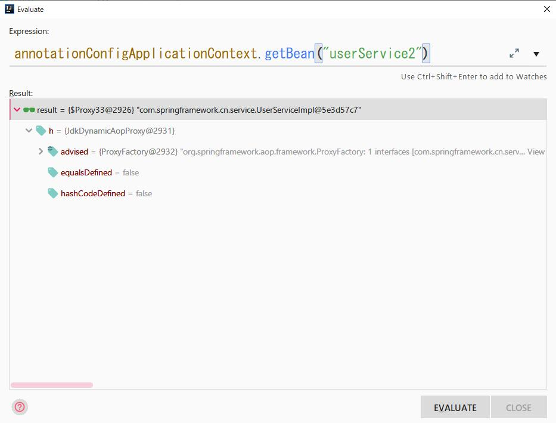

# Spring 源码学习<2>

> [!Warning|label:SpringAOP底层原理实现]
>
> + Spring AOP面向切面编程,是OOP的一个补充;实现方式有2中，分别是：
>   - JDK动态代理
>     + 针对的是实现了接口的实现类;
>     + 底层是通过继承Proxy类和实现InvocationHandle回调接口的Invoke函数实现
>     + 方法拦截:
>       - 在代理对象调用方法时进行拦截，主要是通过实现InvocationHandle的Invoke函数实现
>
>   - CGLIB(Code Generate Library)动态代理
>     + 利用ASM开源包，对代理对象类的class文件即字节码文件进行修改生成子类的形式来进行处理
>     + 主要是通过对指定的类，生成一个子类，覆盖其中的方法实现增强效果
>     + 因为CGLIB采用的是生成子类的方法来实现增强效果，所有被代理的类、或者方法不能用final关键字进行修饰
>     + 方法拦截：
>       - 在代理对象调用方法时CGLIB会调用MethodInterceptor接口的intercept方法进行拦截；该方法类似于JDK中InvocationHandler接口；
>       - 回调函数在生成代理对象的时候，进行设置
>
> + 代理效果: JDK1.8之前，CGLIB代理效果 > JDK动态代理；1.8之后，两者差不多

### Spring AOP 源码学习

> [!Note|label:CGLIB动态代理]

1. 创建@Log注解

```java
// 创建@Log注解，使用AOP进行动态代理操作
package com.springframework.cn.annotation;

import org.springframework.core.annotation.AliasFor;

import java.lang.annotation.*;

@Target(ElementType.METHOD)
@Retention(RetentionPolicy.RUNTIME)
@Documented
public @interface Log {
    String content() default "";
}
```

2. 创建UserController.java，在方法中使用@Log注解

```java
package com.springframework.cn.web;

import com.springframework.cn.annotation.Log;
import com.springframework.cn.entity.User;
import com.springframework.cn.service.UserService;
import org.springframework.beans.factory.annotation.Autowired;
import org.springframework.beans.factory.annotation.Qualifier;
import org.springframework.web.bind.annotation.PathVariable;
import org.springframework.web.bind.annotation.RequestMapping;
import org.springframework.web.bind.annotation.RequestMethod;
import org.springframework.web.bind.annotation.RestController;


@RestController
@RequestMapping(value = "/web")
public class UserController {
    @Autowired
    @Qualifier("userService2")
    private  UserService userService;

    @RequestMapping(value = "/login/{id}", method = RequestMethod.GET)
    @Log(content = "正在执行登录操作....")
    public User login(
            @PathVariable("id") int id) {
        return userService.login(id);
    }
}
```

3. 创建LogAspect.java,使用AOP动态代理对@Log注解进行操作

```java
package com.springframework.cn.aop;

import com.springframework.cn.annotation.Log;
import org.aspectj.lang.ProceedingJoinPoint;
import org.aspectj.lang.annotation.Around;
import org.aspectj.lang.annotation.Aspect;
import org.springframework.stereotype.Component;

@Aspect
@Component
public class LogAspect {

    /**
     * 对com.springframework.cn.web包下名称中以
     * xxxController类中的方法 &&
     * 该类中方法使用了@Log注解的方法进行横切操作
     */
    @Around("execution(public * com.springframework.cn.web.*Controller.*(..)) && @annotation(log)")
    public Object handleLog(ProceedingJoinPoint proceedingJoinPoint, Log log) throws Throwable {
        String content = log.content();
        if (!content.isEmpty()) {
            System.err.println(content);
        }
        return proceedingJoinPoint.proceed();
    }
}
```

4. 源码方法调用流程

    <1> AOP生成代理对象是在SpringIOC初始化Bean方法中实例化完成之后的BeanPostProcessor中调用;

    ```java
    org.springframework.beans.factory.support.AbstractAutowireCapableBeanFactory#applyBeanPostProcessorsAfterInitialization

    // 实例化完成之后，调用BeanPostProcessor后置处理器，对Bean进行封装生成代理对象
    @Override
    public Object applyBeanPostProcessorsAfterInitialization(Object existingBean, String beanName)
            throws BeansException {

        Object result = existingBean;
        for (BeanPostProcessor processor : getBeanPostProcessors()) {
            // 实例化之后的BeanPostProcessor后置处理器
            Object current = processor.postProcessAfterInitialization(result, beanName);

            if (current == null) {
                return result;
            }
            result = current;
        }
        return result;
    }
    ```

    <2> AbstractAutoProxyCreator.java中实现了postProcessAfterInitialization()方法，用于生成代理对象

    ```java
    @Override
    public Object postProcessAfterInitialization(@Nullable Object bean, String beanName) {
        if (bean != null) {
            /**
             * 构造一个缓存对象的key;
             * <1> 普通Bean的key为beanName
             * <2> FactoryBean的key为 & + beanName
             */
            Object cacheKey = getCacheKey(bean.getClass(), beanName);
            // 从 map中获取可以为cacheKey的值
            if (this.earlyProxyReferences.remove(cacheKey) != bean) {
                // 对bean进行封装，返回一个代理对象
                return wrapIfNecessary(bean, beanName, cacheKey);
            }
        }
        return bean;
    }
    ```

    <3> wrapIfNecessary()对bean实例进行封装生成代理对象

    ```java
    protected Object wrapIfNecessary(Object bean, String beanName, Object cacheKey) {
        if (StringUtils.hasLength(beanName) && this.targetSourcedBeans.contains(beanName)) {
            return bean;
        }
        if (Boolean.FALSE.equals(this.advisedBeans.get(cacheKey))) {
            return bean;
        }
        if (isInfrastructureClass(bean.getClass()) || shouldSkip(bean.getClass(), beanName)) {
            this.advisedBeans.put(cacheKey, Boolean.FALSE);
            return bean;
        }

        // 如果存在advice(通知)，则创建代理对象
        Object[] specificInterceptors = getAdvicesAndAdvisorsForBean(bean.getClass(), beanName, null);

        /**
         * 所有的advice都实现了MethodInteceptor接口；
         * 获取匹配的advice ！= null
         */
        if (specificInterceptors != DO_NOT_PROXY) {
            // 将该bean标识为 需要被通知的Bean
            this.advisedBeans.put(cacheKey, Boolean.TRUE);

            // 创建代理对象
            Object proxy = createProxy(
                    bean.getClass(), beanName, specificInterceptors, new SingletonTargetSource(bean));

            // 将代理类加入到集合中
            this.proxyTypes.put(cacheKey, proxy.getClass());
            // 返回代理对象
            return proxy;
        }

        this.advisedBeans.put(cacheKey, Boolean.FALSE);
        return bean;
    }
    ```

    <4> createProxy() 创建的代理的核心方法

    ```java
    org.springframework.aop.framework.autoproxy.AbstractAutoProxyCreator#createProxy

    // 给指定的Bean创建一个proxy对象
    protected Object createProxy(Class<?> beanClass, @Nullable String beanName,
            @Nullable Object[] specificInterceptors, TargetSource targetSource) {

        // beanFactory是DefaultListableBeanFactory类型，该类型实现了ConfigurableListableBeanFactory接口
        if (this.beanFactory instanceof ConfigurableListableBeanFactory) {
            AutoProxyUtils.exposeTargetClass((ConfigurableListableBeanFactory) this.beanFactory, beanName, beanClass);
        }

        // 创建代理工厂
        ProxyFactory proxyFactory = new ProxyFactory();
        // 拷贝配置信息
        proxyFactory.copyFrom(this);

        if (!proxyFactory.isProxyTargetClass()) {

            // 判断beanClass是否可以使用目标class进行代理,而不是使用接口进行代理
            if (shouldProxyTargetClass(beanClass, beanName)) {
                /**
                 * 设置对目标类生成代理
                 * 该属性对选择使用哪种动态代理时有用
                 */
                proxyFactory.setProxyTargetClass(true);
            }
            else {
                /**
                 * 获取Bean上面的接口并进行判断，
                 * <1> 存在接口，则将接口增加到proxyFactory中，进行代理接口
                 * <2> 不存在接口，则设置setProxyTargetClass属性为true，表示代理class
                 */
                evaluateProxyInterfaces(beanClass, proxyFactory);
            }
        }

        // 对advise进行封装
        Advisor[] advisors = buildAdvisors(beanName, specificInterceptors);
        // 代理工程添加advice
        proxyFactory.addAdvisors(advisors);
        proxyFactory.setTargetSource(targetSource);
        // 用于扩展
        customizeProxyFactory(proxyFactory);

        proxyFactory.setFrozen(this.freezeProxy);
        if (advisorsPreFiltered()) {
            proxyFactory.setPreFiltered(true);
        }
        // getProxyClassLocader() 获取代理类加载器
        return proxyFactory.getProxy(getProxyClassLoader());
    }
    ```

    <5> getProxy() 根据代理工厂的配置创建一个代理对象

    ```java
    public Object getProxy(@Nullable ClassLoader classLoader) {
        // createAopProxy 获取Proxy代理，调用getProxy()方法获取代理对象
        return createAopProxy().getProxy(classLoader);
    }
    ```

    <6> createAopProxy() 方法的实现;

    > 判断目标类Bean上是否存在接口，如存在接口，则将接口增加到proxyFactory中，使用JDK动态代理
    >
    > 若不在，则设置proxyTargetClass属性为true，使用CGLIB动态代理

    ```java
    org.springframework.aop.framework.DefaultAopProxyFactory#createAopProxy

    @Override
    public AopProxy createAopProxy(AdvisedSupport config) throws AopConfigException {

        //是否需要优化代理生产策略 || 目标类(不是接口)是否需要代理 || hasNoUserSuppliedProxyInterfaces 是否是SpringProxy的实现类
        if (config.isOptimize() || config.isProxyTargetClass() || hasNoUserSuppliedProxyInterfaces(config)) {
            // 获取目标类的Class类型
            Class<?> targetClass = config.getTargetClass();
            if (targetClass == null) {
                throw new AopConfigException("TargetSource cannot determine target class: " +
                        "Either an interface or a target is required for proxy creation.");
            }

            // 如果目标类是接口 || （目标类继承了proxy类 &&proxyClassCache缓存中包含指定目标类）
            if (targetClass.isInterface() || Proxy.isProxyClass(targetClass)) {
                // 采用JDK动态代理
                return new JdkDynamicAopProxy(config);
            }

            // 代理class 采用CGLIB
            return new ObjenesisCglibAopProxy(config);
        }
        else {
            // 采用JDK动态代理
            return new JdkDynamicAopProxy(config);
        }
    }
    ```

    <7> getProxy() CGLIB中该方法的实现；获取代理对象

    > <1> **CGLIB使用Enhance来实现增强，通过对指定的类生成一个子类，覆盖其中的方法实现增强效果**
    >
    > <2> **通过在生成代理对象时，设置回调函数的形式实现代理对象调用方法的拦截**
    >
    > <3> **回调函数如DynamicAdviseInterceptor都需要重写MethodInterceptor接口中interceptor()**

    ```java
    org.springframework.aop.framework.CglibAopProxy#getProxy

    @Override
    public Object getProxy(@Nullable ClassLoader classLoader) {
        if (logger.isTraceEnabled()) {
            logger.trace("Creating CGLIB proxy: " + this.advised.getTargetSource());
        }

        try {
            // 获取目标类的类对象
            Class<?> rootClass = this.advised.getTargetClass();

            Assert.state(rootClass != null, "Target class must be available for creating a CGLIB proxy");

            Class<?> proxySuperClass = rootClass;

            if (rootClass.getName().contains(ClassUtils.CGLIB_CLASS_SEPARATOR)) {
                proxySuperClass = rootClass.getSuperclass();
                Class<?>[] additionalInterfaces = rootClass.getInterfaces();
                for (Class<?> additionalInterface : additionalInterfaces) {
                    this.advised.addInterface(additionalInterface);
                }
            }

            // Validate the class, writing log messages as necessary.
            validateClassIfNecessary(proxySuperClass, classLoader);

            // 配置CGLIB增强器
            Enhancer enhancer = createEnhancer();

            if (classLoader != null) {
                // 设置类加载器
                enhancer.setClassLoader(classLoader);
                if (classLoader instanceof SmartClassLoader &&
                        ((SmartClassLoader) classLoader).isClassReloadable(proxySuperClass)) {
                    enhancer.setUseCache(false);
                }
            }
            // 设置超类为需要代理的类的字节码
            enhancer.setSuperclass(proxySuperClass);
            enhancer.setInterfaces(AopProxyUtils.completeProxiedInterfaces(this.advised));
            // 设置命名策略
            enhancer.setNamingPolicy(SpringNamingPolicy.INSTANCE);
            enhancer.setStrategy(new ClassLoaderAwareGeneratorStrategy(classLoader));

            /**
             * 设置callback回调函数，用于代理对象调用方法时的处理回调与JDK动态代理的InvocationHandle一样;
             * <1> 回调函数需要重写MethodInterceptor中的Inteceptor()函数
             * 如 DynamicAdvisedInterceptor
             */
            Callback[] callbacks = getCallbacks(rootClass);
            Class<?>[] types = new Class<?>[callbacks.length];
            for (int x = 0; x < types.length; x++) {
                types[x] = callbacks[x].getClass();
            }
            // fixedInterceptorMap only populated at this point, after getCallbacks call above
            enhancer.setCallbackFilter(new ProxyCallbackFilter(
                    this.advised.getConfigurationOnlyCopy(), this.fixedInterceptorMap, this.fixedInterceptorOffset));
            enhancer.setCallbackTypes(types);

            // 生成代理对象并返回代理实例
            return createProxyClassAndInstance(enhancer, callbacks);
        }
        catch (CodeGenerationException | IllegalArgumentException ex) {
            throw new AopConfigException("Could not generate CGLIB subclass of " + this.advised.getTargetClass() +
                    ": Common causes of this problem include using a final class or a non-visible class",
                    ex);
        }
        catch (Throwable ex) {
            // TargetSource.getTarget() failed
            throw new AopConfigException("Unexpected AOP exception", ex);
        }
    ```

    <8> createProxyClassAndInstance() 创建代理对象并返回是实例

    ```java
    protected Object createProxyClassAndInstance(Enhancer enhancer, Callback[] callbacks) {
    enhancer.setInterceptDuringConstruction(false);
    enhancer.setCallbacks(callbacks);
    // 通过enhancer.create() 创建代理对象
    return (this.constructorArgs != null && this.constructorArgTypes != null ?
            enhancer.create(this.constructorArgTypes, this.constructorArgs) :
            enhancer.create());
    }
    ```

    <9> CGLIB生成的代理对象

    > 生成的代理对象的形式为: 类名+$$EnhanceBySpringCGLIB$$+数字
    >
    > 代理对象中含有回调函数(即AOP中设置的通知)，用于代理对象调用方法进行拦截

    

    > 对比,没有被代理的对象

    

> [!Note|label:JDK动态代理]

1. 创建UserService.java 接口

```java
package com.springframework.cn.service;

import com.springframework.cn.entity.User;

public interface UserService {

    User login(int id);
}
```

2. 创建UserServiceImple.java实现UserService.java接口

```java
package com.springframework.cn.service;

import com.springframework.cn.entity.User;
import org.aspectj.lang.annotation.Around;
import org.springframework.stereotype.Service;

@Service("userService2")
public class UserServiceImpl implements UserService{

    @Override
    public User login(int id) {
        User user = new User();
        user.setId(id);
        user.setName("zhangsan");
        user.setAddress("陕西省xxx");
        return user;
    }
}
```

3. 创建CommonAspect.java，使用AOP动态代理对接口中的方法进行横切处理

```java
package com.springframework.cn.aop;

import org.aspectj.lang.annotation.After;
import org.aspectj.lang.annotation.Aspect;
import org.aspectj.lang.annotation.Before;
import org.springframework.stereotype.Component;

@Aspect
@Component
public class CommonAspect {

    // 前置通知
    @Before("execution(public * com.springframework.cn.service.*ServiceImpl*.*(..))")
    public void beforeAdvise() {
        System.err.println("before advise...");
    }

    // 后置通知
    @After("execution(public * com.springframework.cn.service.*ServiceImpl*.*(..))")
    public void afterAdvise() {
        System.err.println("after advise...");
    }
}
```

4. 源码分析方法调用流程

    > <1> - <6> 步骤的调用流程是相同的，除了<4>
    >
    > <4> 中evaluateProxyInterfaces() 执行逻辑不同
    >
    >
    >
    >
    > evaluateProxyInterfaces() 该方法的主要 作用获取目标对象上的接口，  
    遍历接口，判断是否需要代理接口，如果需要则将接口增加到proxyFactory中，  
    若不需要则设置proxyTargetClass属性为true，代理class

    ```java
    protected void evaluateProxyInterfaces(Class<?> beanClass, ProxyFactory proxyFactory) {

        // 获取目标对象上所有的接口
        Class<?>[] targetInterfaces = ClassUtils.getAllInterfacesForClass(beanClass, getProxyClassLoader());

        // 设置代理接口属性为 false
        boolean hasReasonableProxyInterface = false;
        for (Class<?> ifc : targetInterfaces) {

            // 判断接口不是回调函数接口 && 该接口不是内部接口 && 该接口中存在方法

            if (!isConfigurationCallbackInterface(ifc) && !isInternalLanguageInterface(ifc) &&
                    ifc.getMethods().length > 0) {

                // 设置代理接口属性为true
                hasReasonableProxyInterface = true;
                break;
            }
        }
        if (hasReasonableProxyInterface) {
            // Must allow for introductions; can't just set interfaces to the target's interfaces only.
            for (Class<?> ifc : targetInterfaces) {
                // 将需要代理的接口增加至proxyFactory中
                proxyFactory.addInterface(ifc);
            }
        }
        else {
            // 若目标对象上不存在接口，则设置proxyTragetClass=true，表示代理class
            proxyFactory.setProxyTargetClass(true);
        }
    }
    ```

    <7> getProxy() JdkDynamicAopProxy中该方法的实现；获取代理对象

    > <1> **JdkDynamicAopProxy中通过继承Proxy类+实现InvocationHandler接口来实现**
    >
    > <2> **代理对象在调用方法时，通过重写InvocationHandler接口中invoke方法实现拦截**

    ```java
    @Override
    public Object getProxy(@Nullable ClassLoader classLoader) {
        if (logger.isTraceEnabled()) {
            logger.trace("Creating JDK dynamic proxy: " + this.advised.getTargetSource());
        }
        Class<?>[] proxiedInterfaces = AopProxyUtils.completeProxiedInterfaces(this.advised, true);
        findDefinedEqualsAndHashCodeMethods(proxiedInterfaces);

        // 创建代理对象实例
        return Proxy.newProxyInstance(classLoader, proxiedInterfaces, this);
    }
    ```

    <8> newProxyInstance() 通过反射的形式创建代理对象

    > <1> 通过反射的形式创建代理对象
    >
    > <2> 代理对象调用方法时的拦截处理是通过重写InvocationHandler接口中invoke方法实现的，做用类似于CGLIB中MethodInterceptor接口中interceptor()的方法

    ```java
    @CallerSensitive
    public static Object newProxyInstance(ClassLoader loader,
                                          Class<?>[] interfaces,
                                          InvocationHandler h)
        throws IllegalArgumentException
    {
        Objects.requireNonNull(h);

        final Class<?>[] intfs = interfaces.clone();
        final SecurityManager sm = System.getSecurityManager();
        if (sm != null) {
            checkProxyAccess(Reflection.getCallerClass(), loader, intfs);
        }

        /*
         * Look up or generate the designated proxy class.
         */
        Class<?> cl = getProxyClass0(loader, intfs);

        /*
         * Invoke its constructor with the designated invocation handler.
         */
        try {
            if (sm != null) {
                checkNewProxyPermission(Reflection.getCallerClass(), cl);
            }

            final Constructor<?> cons = cl.getConstructor(constructorParams);

            // 设置InvocationHandler用于生成的代理对象调用方法时，进行拦截处理
            final InvocationHandler ih = h;
            if (!Modifier.isPublic(cl.getModifiers())) {
                AccessController.doPrivileged(new PrivilegedAction<Void>() {
                    public Void run() {
                        cons.setAccessible(true);
                        return null;
                    }
                });
            }

            // 通过反射的形式，创建代理实例
            return cons.newInstance(new Object[]{h});

        } catch (IllegalAccessException|InstantiationException e) {
            throw new InternalError(e.toString(), e);
        } catch (InvocationTargetException e) {
            Throwable t = e.getCause();
            if (t instanceof RuntimeException) {
                throw (RuntimeException) t;
            } else {
                throw new InternalError(t.toString(), t);
            }
        } catch (NoSuchMethodException e) {
            throw new InternalError(e.toString(), e);
        }
    }
    ```

    <9> JDK动态代理生成的代理对象

    > 生成的代理对象命名形式: $Proxy+数字
    >
    > 代理对象中含有InvocationHandle接口的实现类对象(重写了Invoke方法)，用于代理对象调用方法进行拦截

    


### Spring JDK动态生成的代理对象

<1> 创建测试方法

```java
    @Test
    public void testJdkDynamicAopProxy() throws IOException {
        // 获取生成的aop代理对象文件
        byte[] bytes = ProxyGenerator.generateProxyClass("$Proxy", UserServiceImpl.class.getInterfaces());
        String fileName = "C:\\Users\\xxxx\\Desktop\\UserServiceImplProxy.class";
        FileOutputStream out = new FileOutputStream(fileName);
        out.write(bytes);
        out.flush();
        out.close();
    }
```

<2> JDK动态生成的代理类

   > **从JDK动态生成的代理类中，可以知道生成的代理类默认会继承一个Proxy类，因此JDK动态代理只能代理接口，不能代理class**

```java
import com.springframework.cn.entity.User;
import com.springframework.cn.service.UserService;
import java.lang.reflect.InvocationHandler;
import java.lang.reflect.Method;
import java.lang.reflect.Proxy;
import java.lang.reflect.UndeclaredThrowableException;

public final class $Proxy extends Proxy implements UserService {
    private static Method m1;
    private static Method m2;
    private static Method m0;
    private static Method m3;

    public $Proxy(InvocationHandler var1) throws  {
        super(var1);
    }

    public final boolean equals(Object var1) throws  {
        try {
            return (Boolean)super.h.invoke(this, m1, new Object[]{var1});
        } catch (RuntimeException | Error var3) {
            throw var3;
        } catch (Throwable var4) {
            throw new UndeclaredThrowableException(var4);
        }
    }

    public final String toString() throws  {
        try {
            return (String)super.h.invoke(this, m2, (Object[])null);
        } catch (RuntimeException | Error var2) {
            throw var2;
        } catch (Throwable var3) {
            throw new UndeclaredThrowableException(var3);
        }
    }

    public final int hashCode() throws  {
        try {
            return (Integer)super.h.invoke(this, m0, (Object[])null);
        } catch (RuntimeException | Error var2) {
            throw var2;
        } catch (Throwable var3) {
            throw new UndeclaredThrowableException(var3);
        }
    }

    public final User login(int var1) throws  {
        try {
            return (User)super.h.invoke(this, m3, new Object[]{var1});
        } catch (RuntimeException | Error var3) {
            throw var3;
        } catch (Throwable var4) {
            throw new UndeclaredThrowableException(var4);
        }
    }

    static {
        try {
            m1 = Class.forName("java.lang.Object").getMethod("equals", Class.forName("java.lang.Object"));
            m2 = Class.forName("java.lang.Object").getMethod("toString");
            m0 = Class.forName("java.lang.Object").getMethod("hashCode");
            m3 = Class.forName("com.springframework.cn.service.UserService").getMethod("login", Integer.TYPE);
        } catch (NoSuchMethodException var2) {
            throw new NoSuchMethodError(var2.getMessage());
        } catch (ClassNotFoundException var3) {
            throw new NoClassDefFoundError(var3.getMessage());
        }
    }
}
```


### Spring CGLIB使用Enhance动态生成的代理对象

<1> 创建测试方法

```java
public void testCGLIBEnhance() throws IOException {
    // 设置DebuggingClassWriter.DEBUG_LOCATION_PROPERTY属性，在运行时CGLIB便会生成代理类的class
    System.setProperty(DebuggingClassWriter.DEBUG_LOCATION_PROPERTY, "C:\\Users\\xxx\\Desktop\\test");
    Enhancer enhancer = new Enhancer();
    enhancer.setSuperclass(UserController.class);
    // 必须设置一个回调函数，否则会出现空指针异常
    enhancer.setCallback(new MethodInterceptor() {
        @Override
        public Object intercept(Object o, Method method, Object[] objects, MethodProxy methodProxy) throws Throwable {
            return null;
        }
    });
    Object object = enhancer.create();
}
```

<2> CGLIB动态生成的代理类

   > **从CGLIB动态生成的代理类中，可以知道生成的代理类是目标类的一个子类，继承了目标类，并且重写了目标类的方法**

```java
package com.springframework.cn.web;

import com.springframework.cn.entity.User;
import java.lang.reflect.Method;
import org.springframework.cglib.core.ReflectUtils;
import org.springframework.cglib.core.Signature;
import org.springframework.cglib.proxy.Callback;
import org.springframework.cglib.proxy.Factory;
import org.springframework.cglib.proxy.MethodInterceptor;
import org.springframework.cglib.proxy.MethodProxy;

public class UserController$$EnhancerByCGLIB$$ec131f61 extends UserController implements Factory {
    private boolean CGLIB$BOUND;
    public static Object CGLIB$FACTORY_DATA;
    private static final ThreadLocal CGLIB$THREAD_CALLBACKS;
    private static final Callback[] CGLIB$STATIC_CALLBACKS;
    private MethodInterceptor CGLIB$CALLBACK_0;
    private static Object CGLIB$CALLBACK_FILTER;
    private static final Method CGLIB$login$0$Method;
    private static final MethodProxy CGLIB$login$0$Proxy;
    private static final Object[] CGLIB$emptyArgs;
    private static final Method CGLIB$equals$1$Method;
    private static final MethodProxy CGLIB$equals$1$Proxy;
    private static final Method CGLIB$toString$2$Method;
    private static final MethodProxy CGLIB$toString$2$Proxy;
    private static final Method CGLIB$hashCode$3$Method;
    private static final MethodProxy CGLIB$hashCode$3$Proxy;
    private static final Method CGLIB$clone$4$Method;
    private static final MethodProxy CGLIB$clone$4$Proxy;

    static void CGLIB$STATICHOOK1() {
        CGLIB$THREAD_CALLBACKS = new ThreadLocal();
        CGLIB$emptyArgs = new Object[0];
        Class var0 = Class.forName("com.springframework.cn.web.UserController$$EnhancerByCGLIB$$ec131f61");
        Class var1;
        CGLIB$login$0$Method = ReflectUtils.findMethods(new String[]{"login", "(I)Lcom/springframework/cn/entity/User;"}, (var1 = Class.forName("com.springframework.cn.web.UserController")).getDeclaredMethods())[0];
        CGLIB$login$0$Proxy = MethodProxy.create(var1, var0, "(I)Lcom/springframework/cn/entity/User;", "login", "CGLIB$login$0");
        Method[] var10000 = ReflectUtils.findMethods(new String[]{"equals", "(Ljava/lang/Object;)Z", "toString", "()Ljava/lang/String;", "hashCode", "()I", "clone", "()Ljava/lang/Object;"}, (var1 = Class.forName("java.lang.Object")).getDeclaredMethods());
        CGLIB$equals$1$Method = var10000[0];
        CGLIB$equals$1$Proxy = MethodProxy.create(var1, var0, "(Ljava/lang/Object;)Z", "equals", "CGLIB$equals$1");
        CGLIB$toString$2$Method = var10000[1];
        CGLIB$toString$2$Proxy = MethodProxy.create(var1, var0, "()Ljava/lang/String;", "toString", "CGLIB$toString$2");
        CGLIB$hashCode$3$Method = var10000[2];
        CGLIB$hashCode$3$Proxy = MethodProxy.create(var1, var0, "()I", "hashCode", "CGLIB$hashCode$3");
        CGLIB$clone$4$Method = var10000[3];
        CGLIB$clone$4$Proxy = MethodProxy.create(var1, var0, "()Ljava/lang/Object;", "clone", "CGLIB$clone$4");
    }

    final User CGLIB$login$0(int var1) {
        return super.login(var1);
    }

    public final User login(int var1) {
        MethodInterceptor var10000 = this.CGLIB$CALLBACK_0;
        if (var10000 == null) {
            CGLIB$BIND_CALLBACKS(this);
            var10000 = this.CGLIB$CALLBACK_0;
        }

        return var10000 != null ? (User)var10000.intercept(this, CGLIB$login$0$Method, new Object[]{new Integer(var1)}, CGLIB$login$0$Proxy) : super.login(var1);
    }

    final boolean CGLIB$equals$1(Object var1) {
        return super.equals(var1);
    }

    public final boolean equals(Object var1) {
        MethodInterceptor var10000 = this.CGLIB$CALLBACK_0;
        if (var10000 == null) {
            CGLIB$BIND_CALLBACKS(this);
            var10000 = this.CGLIB$CALLBACK_0;
        }

        if (var10000 != null) {
            Object var2 = var10000.intercept(this, CGLIB$equals$1$Method, new Object[]{var1}, CGLIB$equals$1$Proxy);
            return var2 == null ? false : (Boolean)var2;
        } else {
            return super.equals(var1);
        }
    }

    final String CGLIB$toString$2() {
        return super.toString();
    }

    public final String toString() {
        MethodInterceptor var10000 = this.CGLIB$CALLBACK_0;
        if (var10000 == null) {
            CGLIB$BIND_CALLBACKS(this);
            var10000 = this.CGLIB$CALLBACK_0;
        }

        return var10000 != null ? (String)var10000.intercept(this, CGLIB$toString$2$Method, CGLIB$emptyArgs, CGLIB$toString$2$Proxy) : super.toString();
    }

    final int CGLIB$hashCode$3() {
        return super.hashCode();
    }

    public final int hashCode() {
        MethodInterceptor var10000 = this.CGLIB$CALLBACK_0;
        if (var10000 == null) {
            CGLIB$BIND_CALLBACKS(this);
            var10000 = this.CGLIB$CALLBACK_0;
        }

        if (var10000 != null) {
            Object var1 = var10000.intercept(this, CGLIB$hashCode$3$Method, CGLIB$emptyArgs, CGLIB$hashCode$3$Proxy);
            return var1 == null ? 0 : ((Number)var1).intValue();
        } else {
            return super.hashCode();
        }
    }

    final Object CGLIB$clone$4() throws CloneNotSupportedException {
        return super.clone();
    }

    protected final Object clone() throws CloneNotSupportedException {
        MethodInterceptor var10000 = this.CGLIB$CALLBACK_0;
        if (var10000 == null) {
            CGLIB$BIND_CALLBACKS(this);
            var10000 = this.CGLIB$CALLBACK_0;
        }

        return var10000 != null ? var10000.intercept(this, CGLIB$clone$4$Method, CGLIB$emptyArgs, CGLIB$clone$4$Proxy) : super.clone();
    }

    public static MethodProxy CGLIB$findMethodProxy(Signature var0) {
        String var10000 = var0.toString();
        switch(var10000.hashCode()) {
        case -508378822:
            if (var10000.equals("clone()Ljava/lang/Object;")) {
                return CGLIB$clone$4$Proxy;
            }
            break;
        case -394805393:
            if (var10000.equals("login(I)Lcom/springframework/cn/entity/User;")) {
                return CGLIB$login$0$Proxy;
            }
            break;
        case 1826985398:
            if (var10000.equals("equals(Ljava/lang/Object;)Z")) {
                return CGLIB$equals$1$Proxy;
            }
            break;
        case 1913648695:
            if (var10000.equals("toString()Ljava/lang/String;")) {
                return CGLIB$toString$2$Proxy;
            }
            break;
        case 1984935277:
            if (var10000.equals("hashCode()I")) {
                return CGLIB$hashCode$3$Proxy;
            }
        }

        return null;
    }

    public UserController$$EnhancerByCGLIB$$ec131f61() {
        CGLIB$BIND_CALLBACKS(this);
    }

    public static void CGLIB$SET_THREAD_CALLBACKS(Callback[] var0) {
        CGLIB$THREAD_CALLBACKS.set(var0);
    }

    public static void CGLIB$SET_STATIC_CALLBACKS(Callback[] var0) {
        CGLIB$STATIC_CALLBACKS = var0;
    }

    private static final void CGLIB$BIND_CALLBACKS(Object var0) {
        UserController$$EnhancerByCGLIB$$ec131f61 var1 = (UserController$$EnhancerByCGLIB$$ec131f61)var0;
        if (!var1.CGLIB$BOUND) {
            var1.CGLIB$BOUND = true;
            Object var10000 = CGLIB$THREAD_CALLBACKS.get();
            if (var10000 == null) {
                var10000 = CGLIB$STATIC_CALLBACKS;
                if (var10000 == null) {
                    return;
                }
            }

            var1.CGLIB$CALLBACK_0 = (MethodInterceptor)((Callback[])var10000)[0];
        }

    }

    public Object newInstance(Callback[] var1) {
        CGLIB$SET_THREAD_CALLBACKS(var1);
        UserController$$EnhancerByCGLIB$$ec131f61 var10000 = new UserController$$EnhancerByCGLIB$$ec131f61();
        CGLIB$SET_THREAD_CALLBACKS((Callback[])null);
        return var10000;
    }

    public Object newInstance(Callback var1) {
        CGLIB$SET_THREAD_CALLBACKS(new Callback[]{var1});
        UserController$$EnhancerByCGLIB$$ec131f61 var10000 = new UserController$$EnhancerByCGLIB$$ec131f61();
        CGLIB$SET_THREAD_CALLBACKS((Callback[])null);
        return var10000;
    }

    public Object newInstance(Class[] var1, Object[] var2, Callback[] var3) {
        CGLIB$SET_THREAD_CALLBACKS(var3);
        UserController$$EnhancerByCGLIB$$ec131f61 var10000 = new UserController$$EnhancerByCGLIB$$ec131f61;
        switch(var1.length) {
        case 0:
            var10000.<init>();
            CGLIB$SET_THREAD_CALLBACKS((Callback[])null);
            return var10000;
        default:
            throw new IllegalArgumentException("Constructor not found");
        }
    }

    public Callback getCallback(int var1) {
        CGLIB$BIND_CALLBACKS(this);
        MethodInterceptor var10000;
        switch(var1) {
        case 0:
            var10000 = this.CGLIB$CALLBACK_0;
            break;
        default:
            var10000 = null;
        }

        return var10000;
    }

    public void setCallback(int var1, Callback var2) {
        switch(var1) {
        case 0:
            this.CGLIB$CALLBACK_0 = (MethodInterceptor)var2;
        default:
        }
    }

    public Callback[] getCallbacks() {
        CGLIB$BIND_CALLBACKS(this);
        return new Callback[]{this.CGLIB$CALLBACK_0};
    }

    public void setCallbacks(Callback[] var1) {
        this.CGLIB$CALLBACK_0 = (MethodInterceptor)var1[0];
    }

    static {
        CGLIB$STATICHOOK1();
    }
}
```
