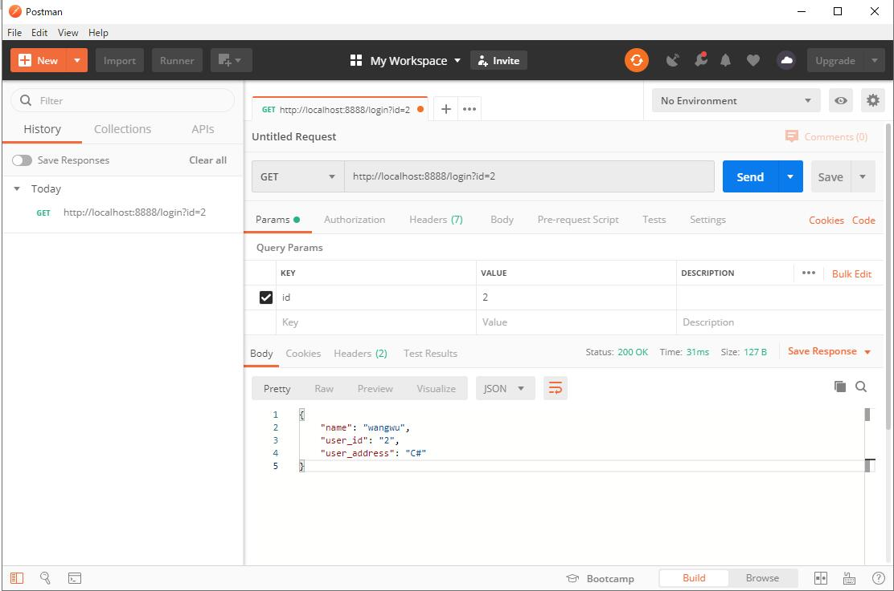

# 手写Spring

> [!Note|label:如何自己实现一个类似Spring的IOC和DI功能]
>
> 主要逻辑:
>   - <1> 配置web.xml文件
>   - <2> 解析配置文件
>   - <3> 扫描包packageScan
>   - <4> 初始化相关类的实例，并且注入IOC容器中
>   - <5> 依赖注入DI
>   - <6> 映射请求

> [!Warning|label:WebApplicationContextServlet核心]
>
> - WebApplicationContextServlet.class该类是手写Spring中的核心类，实现IOC、DI、handleMapping功能

```xml
<?xml version="1.0" encoding="UTF-8"?>
<web-app xmlns="http://xmlns.jcp.org/xml/ns/javaee"
         xmlns:xsi="http://www.w3.org/2001/XMLSchema-instance"
         xsi:schemaLocation="http://xmlns.jcp.org/xml/ns/javaee http://xmlns.jcp.org/xml/ns/javaee/web-app_4_0.xsd"
         version="4.0">

    <servlet>
        <servlet-name>webApplicationContextServlet</servlet-name>
        <servlet-class>org.example.cn.WebApplicationContextServlet</servlet-class>
        <init-param>
            <param-name>contextConfigLocation</param-name>
            <param-value>classpath:application.properties</param-value>
        </init-param>
        <load-on-startup>1</load-on-startup>
    </servlet>

    <servlet-mapping>
        <servlet-name>webApplicationContextServlet</servlet-name>
        <url-pattern>/*</url-pattern>
    </servlet-mapping>

</web-app>
```

```java
// 使用的注解均为自定义注解
public class WebApplicationContextServlet extends HttpServlet {

    private static final String LOCATION = "contextConfigLocation";
    private static final String CLASSPATH_PREFIX = "classpath:";
    private static List<String> classNames = new ArrayList<>();
    // IOC 容器
    private static final Map<String, Object> container = new ConcurrentHashMap<>();
    // URL 请求映射
    private static final Map<String, Object> urlMapping = new ConcurrentHashMap<>();

    Properties p = new Properties();

    @Override
    protected void doGet(HttpServletRequest req, HttpServletResponse resp) throws ServletException, IOException {
        this.doPost(req, resp);
    }


    @Override
    protected void doPost(HttpServletRequest req, HttpServletResponse resp) throws ServletException, IOException {
        // 没有映射关系，则直接结束
        if (urlMapping.isEmpty()) {
            return;
        }
        String uri = req.getRequestURI();
        if (!urlMapping.containsKey(uri)) {
            resp.getWriter().write("404 NOT FOUND!");
            return;
        }
        Method method = (Method) urlMapping.get(uri);
        // 这里简单处理，只针对url?id=1这种形式
        Map<String, String[]> params = req.getParameterMap();
        String beanName = lowerFirstCase(
                method.getDeclaringClass().getSimpleName());
        try {
            Object obj = method.invoke(container.get(beanName), params.get("id")[0]);

            // 以JSON的形式进行输出
            ObjectMapper objectMapper = new ObjectMapper();
            String jsonStr = objectMapper.writeValueAsString(obj);
            resp.getWriter().write(jsonStr);
        } catch (Exception e) {
            e.printStackTrace();
        }
    }

    @Override
    public void init(ServletConfig config) throws ServletException {
        // 解析配置文件
        resolveConfig(config);
        // 扫描包packageScan
        doScanPackage(p.getProperty("packageScan"));
        // 初始化相关类的实例，并且注入IOC容器中
        try {
            doInstance();
        } catch (Exception e) {
            e.printStackTrace();
        }

        // 依赖注入
        doAutowired();

        // 映射请求
        doRequestMapping();

        // 初始化完成
        System.err.println("Spring Init Finish!");
    }

    // <1> 解析配置文件
    private void resolveConfig(ServletConfig config) throws ServletException {
        String location = config.getInitParameter(LOCATION);
        boolean isHasPrefix = location.startsWith(CLASSPATH_PREFIX);
        if (isHasPrefix) {
            location = location.replace(CLASSPATH_PREFIX,"");
        } else {
            throw  new ServletException(String.format("%s parameter setting error!", LOCATION));
        }
        InputStream inputStream = this.getClass().getClassLoader().getResourceAsStream(location);
        try {
            p.load(inputStream);
        } catch (IOException e) {
            e.printStackTrace();
        } finally {
            p.clone();
        }
    }

    // <2> 扫描包
    private void doScanPackage(String packageName) {
        URL url = this.getClass().getClassLoader().getResource("/" + packageName.replaceAll("\\.", "/"));
        File dir = new File(url.getFile());
        for (File file : dir.listFiles()) {
            if (file.isDirectory()) {
                doScanPackage(String.format("%s.%s", packageName, file.getName()));
            } else {
                classNames.add(packageName + "." + file.getName().replace(".class", "").trim());
            }
        }
    }

    // <3> 初始化相关类的实例，并且注入IOC容器中
    private void doInstance() throws Exception {
        if (classNames.isEmpty()) {
            return;
        }
        String key = null;
        // 循环遍历classNames，实例化对象
        for (String className : classNames) {
            Class<?> clazz = Class.forName(className);
            if (clazz.isAnnotationPresent(RestController.class)) {
                // 注入Spring IOC容器中，key为首字母小写的类型
                key = lowerFirstCase(clazz.getSimpleName());
                container.put(key, clazz.newInstance());
            } else if (clazz.isAnnotationPresent(Service.class)) {
                Service service = clazz.getAnnotation(Service.class);
                // 判断用户是否设置了别名
                String alias = service.value();
                if (!"".equals(alias)) {
                    container.put(alias, clazz.newInstance());
                    continue;
                }
                Class<?>[] interfaces = clazz.getInterfaces();
                for (Class<?> i : interfaces) {
                    container.put(i.getName(), clazz.newInstance());
                }
            } else if (clazz.isAnnotationPresent(Repository.class)) {
                Repository repository = clazz.getAnnotation(Repository.class);
                // 判断用户是否设置了别名
                String alias = repository.value();
                if (!"".equals(alias)) {
                    container.put(alias, clazz.newInstance());
                    continue;
                }
                Class<?>[] interfaces = clazz.getInterfaces();
                for (Class<?> i : interfaces) {
                    container.put(i.getName(), clazz.newInstance());
                }
            } else {
                continue;
            }
        }
    }

    // 转换第一个字母为小写
    private String lowerFirstCase(String simpleName) {
        char[] chars = simpleName.toCharArray();
        chars[0] += 32;
        return String.valueOf(chars);
    }

    // <4> 依赖注入
    private void doAutowired() {
        if (container.isEmpty()) {
            return;
        }
        for (Map.Entry<String,Object> entry : container.entrySet()) {
            Object classInstance = entry.getValue();
            Field[] fields = classInstance.getClass().getDeclaredFields();
            for (Field field : fields) {
                // 查看注入字段是否使用了@Autowired注解
                if (!field.isAnnotationPresent(Autowired.class)) {
                    continue;
                }
                Autowired autowired = field.getAnnotation(Autowired.class);
                String dependBeanName = autowired.value().trim();
                // 没有指定依赖的Bean的名称，使用根据Type注入
                if (dependBeanName.isEmpty()) {
                    dependBeanName = field.getType().getName();
                }
                // 设置私有属性的访问权限
                field.setAccessible(true);
                try {
                    field.set(classInstance, container.get(dependBeanName));
                } catch (IllegalAccessException e) {
                    e.printStackTrace();
                    continue;
                }
            }
        }
    }

    // <5> 映射请求
    private void doRequestMapping() {
        RequestMapping requestMapping = null;
        for (Map.Entry<String, Object> entry : container.entrySet()) {
            Object classInstance = entry.getValue();
            Class<?> clazz = classInstance.getClass();
            // 判断当前存在@RestController注解
            if (!clazz.isAnnotationPresent(RestController.class)) {
                continue;
            }
            String urlPrefix = "";
            if (clazz.isAnnotationPresent(RequestMapping.class)) {
                requestMapping = clazz.getAnnotation(RequestMapping.class);
                urlPrefix = requestMapping.path();
            }

            // 解析方法
            Method[] methods = clazz.getDeclaredMethods();

            for (Method method : methods) {
                if (method.isAnnotationPresent(RequestMapping.class)) {
                    requestMapping = method.getAnnotation(RequestMapping.class);
                    // 使用正则替换//
                    String url = ("/" + urlPrefix + requestMapping.path()).replaceAll("/+", "/");
                    urlMapping.put(url, method);
                }
            }
        }
    }
}
```

> [!Note|label:最终运行效果展示]
>
> 


源码:
[https://github.com/dep-darkLonely/Interview/tree/master/project/handSpring](https://github.com/dep-darkLonely/Interview/tree/master/project/handSpring)
